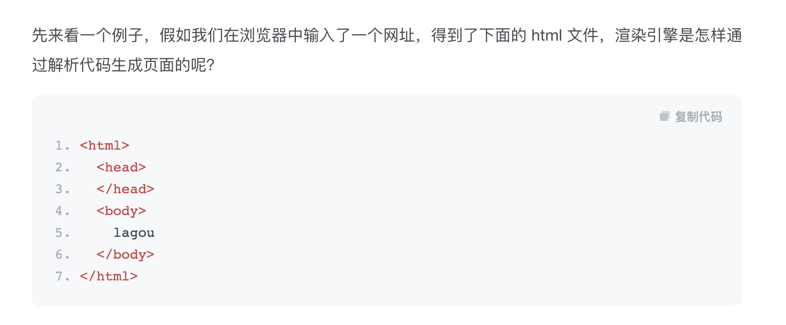
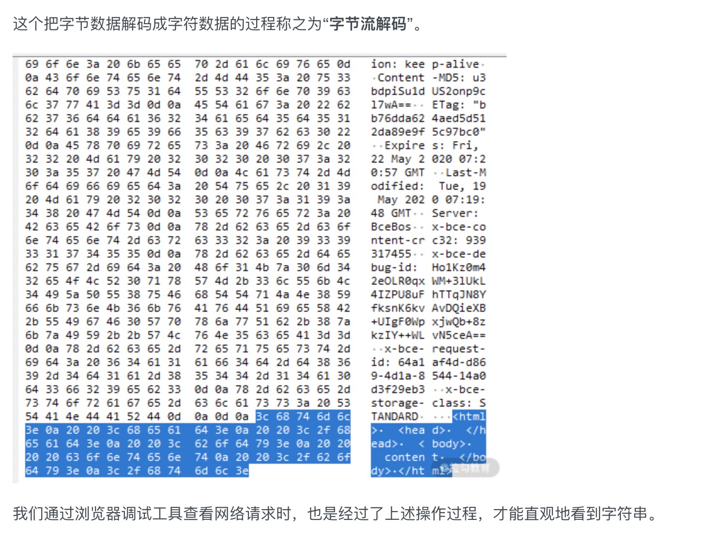
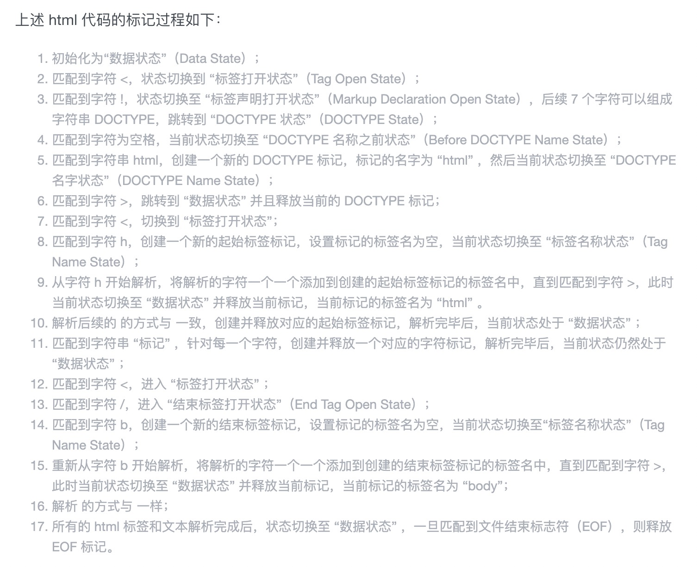
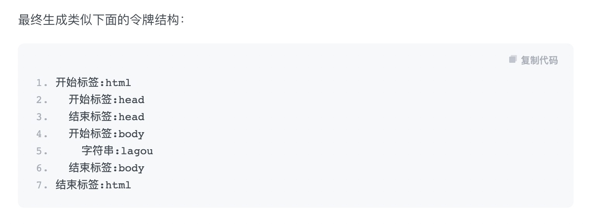
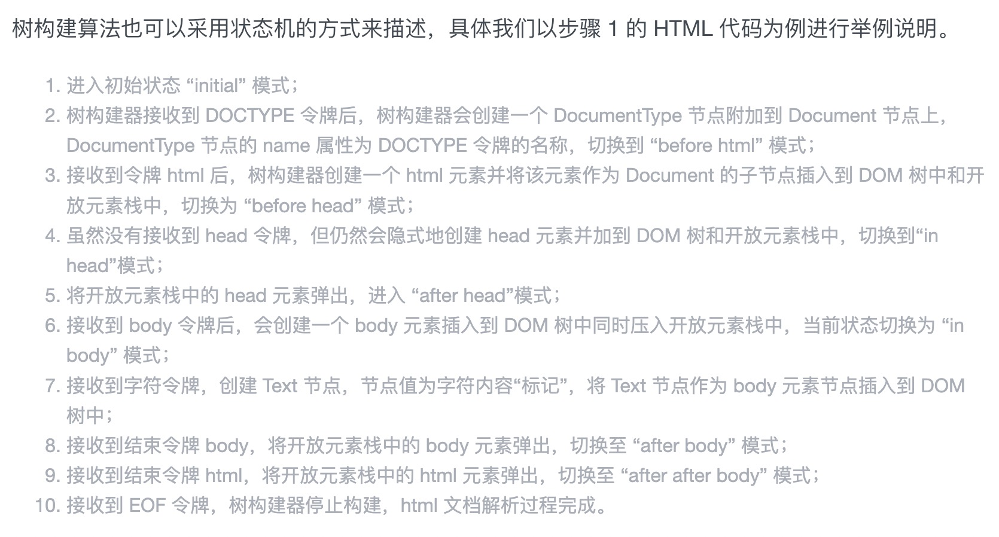
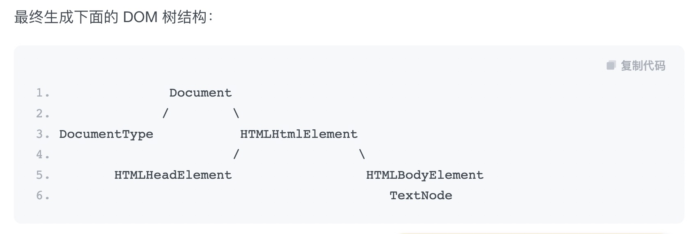
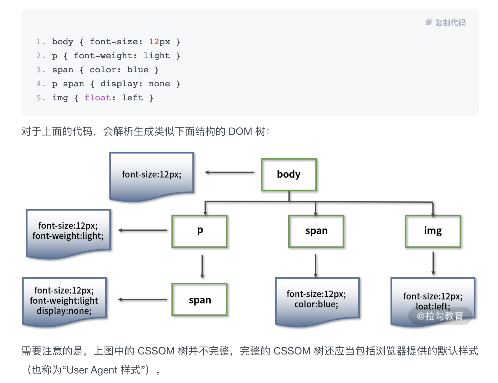

## 浏览器如何渲染页面：
- 假如我们在浏览器中输入了一个网址，得到了下面的 html 文件，渲染引擎是怎样通过解析代码生成页面的呢？

- 以数据变化为线索： 字节 → 字符 → 统一字符 → 令牌 → 树 → 页面

## 从 HTML 到 DOM：

### 1. 字节流解码：字节 → 字符（日常中我们编写的代码）
- 浏览器通过 HTTP 协议接收到的文档内容是字节数据

### 2. 输入流预处理：字符 → 统一字符
- 数据规范化
- 通过上一步解码得到的字符流数据在进入解析环节之前还需要进行一些预处理操作。比如将换行符转换成统一的格式，最终生成规范化的字符流数据，这个把字符数据进行统一格式化的过程称之为“输入流预处理”。

### 3. 令牌化：统一字符 → 令牌
- 经过前两步的数据解码和预处理，下面就要进入重要的解析步骤了。

- 解析包含两步：第一步是将字符数据转化成令牌（Token），第二步是解析 HTML 生成 DOM 树。

- 令牌化：其过程是使用了一种类似状态机的算法，即每次接收一个或多个输入流中的字符；然后根据当前状态和这些字符来更新下一个状态，也就是说在不同的状态下接收同样的字符数据可能会产生不同的结果，比如当接收到“body”字符串时，在标签打开状态会解析成标签，在标签关闭状态则会解析成文本节点。

- 补充 1：遇到 script 标签时的处理

- 如果在 HTML 解析过程中遇到 script 标签，则会发生一些变化。

- 遇到的是内联代码：也就是在 script 标签中直接写代码，那么解析过程会暂停，执行权限会转给 JavaScript 脚本引擎，待 JavaScript 脚本执行完成之后再交由渲染引擎继续解析。

- 有一种情况例外，那就是脚本内容中调用了改变 DOM 结构的 document.write() 函数，此时渲染引擎会回到第二步，将这些代码加入字符流，重新进行解析。

- 如果遇到的是外链脚本，那么渲染引擎会根据标签属性来执行对应的操作（defer, async, HTML5的 type="module"）。

### 4. 构建 DOM 树：令牌 → 树

- 解析 HTML 的第二步是树构建。

- 浏览器在创建解析器的同时会创建一个 Document 对象。

- 在树构建阶段，Document 会作为根节点被不断地修改和扩充。标记步骤产生的令牌会被送到树构建器进行处理。HTML5 标准中定义了每类令牌对应的 DOM 元素，当树构建器接收到某个令牌时就会创建该令牌对应的 DOM 元素并将该元素插入到 DOM 树中。

- 为了纠正元素标签嵌套错位的问题和处理未关闭的元素标签，树构建器创建的新 DOM 元素还会被插入到一个开放元素栈中。

- 补充 2：从 CSS 到 CSSOM
- 渲染引擎除了解析 HTML 之外，也需要解析 CSS。

- CSS 解析的过程与 HTML 解析过程步骤一致，最终也会生成树状结构。

- 与 DOM 树不同的是，CSSOM 树的节点具有继承特性，也就是会先继承父节点样式作为当前样式，然后再进行补充或覆盖。

## 从 DOM 到渲染
- 有了 DOM 树和 CSSOM 树之后，渲染引擎就可以开始生成页面了。

### 5. 构建渲染树
- DOM 树包含的结构内容与 CSSOM 树包含的样式规则都是独立的，为了更方便渲染，先需要将它们合并成一棵渲染树。

- 这个过程会从 DOM 树的根节点开始遍历，然后在 CSSOM 树上找到每个节点对应的样式。

- 遍历过程中会自动忽略那些不需要渲染的节点（比如脚本标记、元标记等）以及不可见的节点（比如设置了“display:none”样式）。同时也会将一些需要显示的伪类元素加到渲染树中。

- 对于上面的 HTML 和 CSS 代码，最终生成的渲染树就只有一个 body 节点，样式为 font-size:12px。

### 6. 布局：施工图
- 生成了渲染树之后，就可以进入布局阶段了，布局就是计算元素的大小及位置。

- 计算元素布局是一个比较复杂的操作，因为需要考虑的因素有很多，包括字体大小、换行位置等，这些因素会影响段落的大小和形状，进而影响下一个段落的位置。

- 布局完成后会输出对应的“盒模型”，它会精确地捕获每个元素的确切位置和大小，将所有相对值都转换为屏幕上的绝对像素。

### 7. 绘制：施工
- 绘制就是将渲染树中的每个节点转换成屏幕上的实际像素的过程。

- 得到布局树这份“施工图”之后，渲染引擎并不能立即绘制，因为还不知道绘制顺序，如果没有弄清楚绘制顺序，那么很可能会导致页面被错误地渲染。

- 例如，对于使用 z-index 属性的元素（如遮罩层）如果未按照正确的顺序绘制，则将导致渲染结果和预期不符（失去遮罩作用）。

- 所以绘制过程中的第一步就是遍历布局树，生成绘制记录，然后渲染引擎会根据绘制记录去绘制相应的内容。

- 对于无动画效果的情况，只需要考虑空间维度，生成不同的图层，然后再把这些图层进行合成，最终成为我们看到的页面。当然这个绘制过程并不是静态不变的，会随着页面滚动不断合成新的图形。

## 总结：
- 浏览器渲染引擎生成页面的 7 个步骤，前面 4 个步骤为 DOM 树的生成过程，后面 3 个步骤是利用 DOM 树和 CSSOM 树来渲染页面的过程

### 最后布置一道思考题：
- 在构建渲染树的时候，渲染引擎需要遍历 DOM 树节点并从 CSSOM 树中找到匹配的样式规则，在匹配过程中是通过自上而下还是自下而上的方式呢？为什么？

- 浏览器进行CSS选择器匹配时，是从右向左进行的，所以可以推知是自下而上