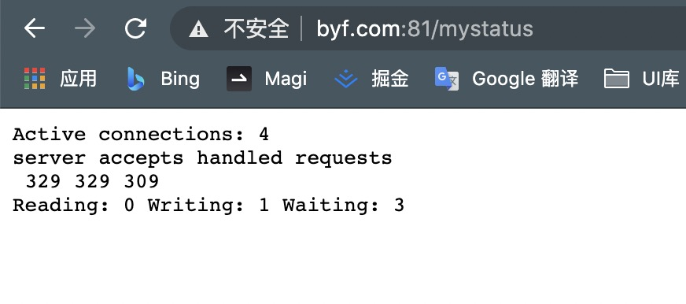
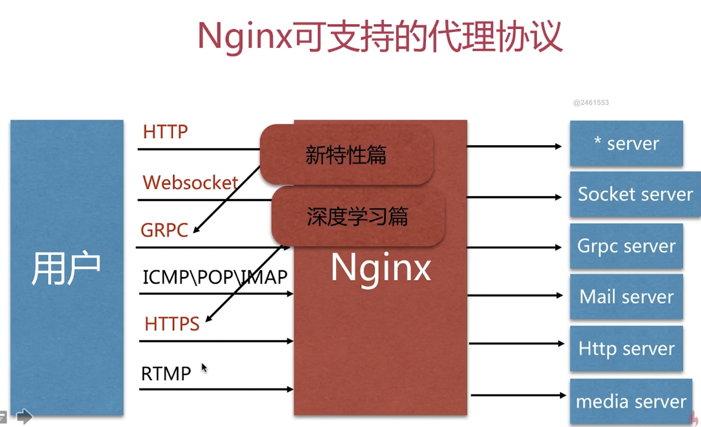
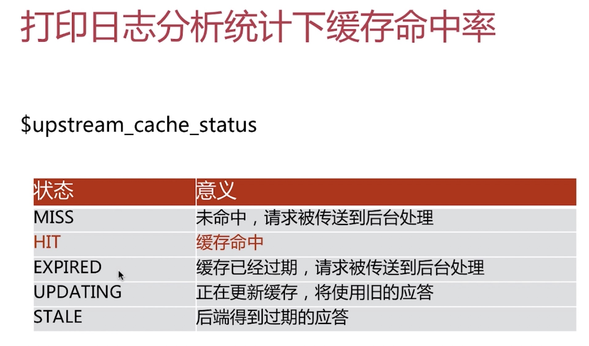
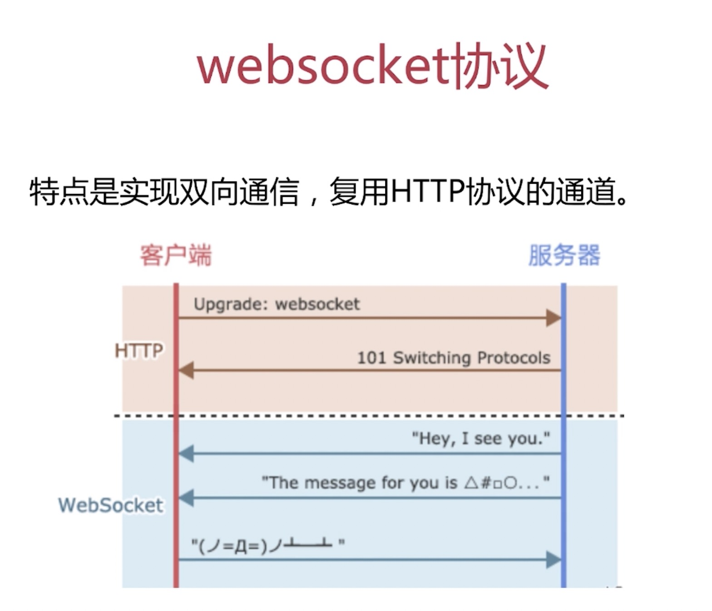
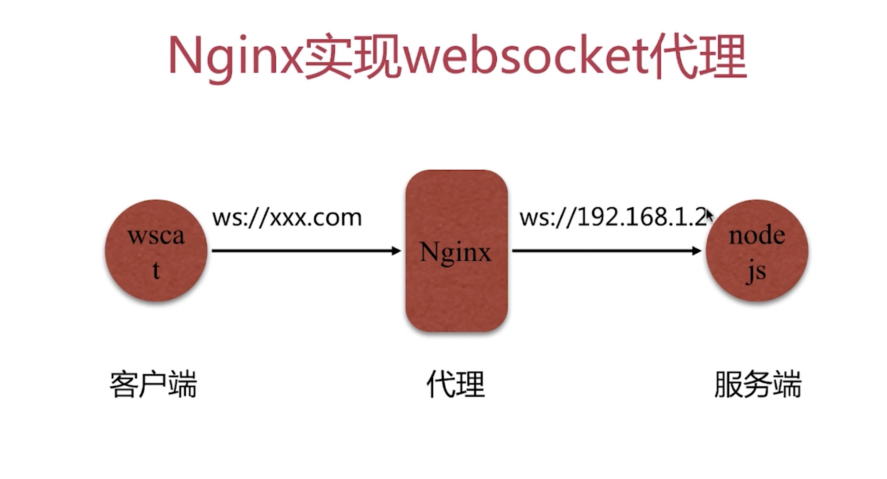
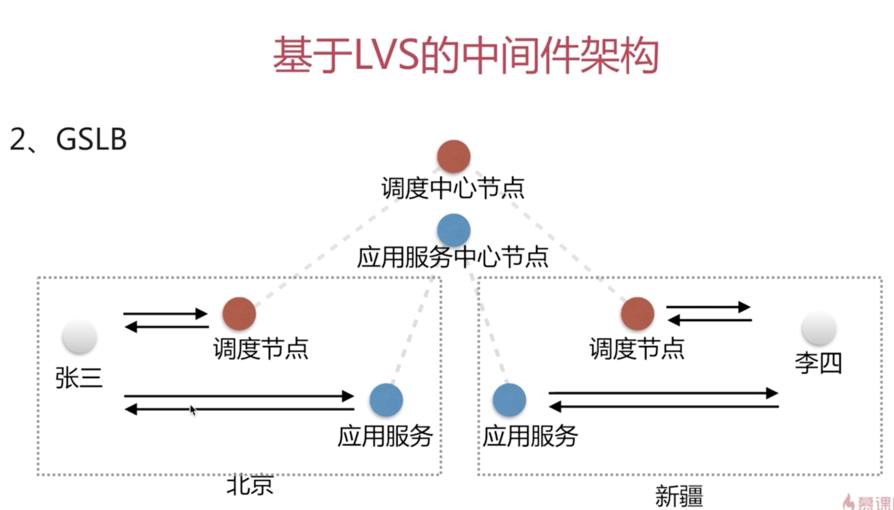
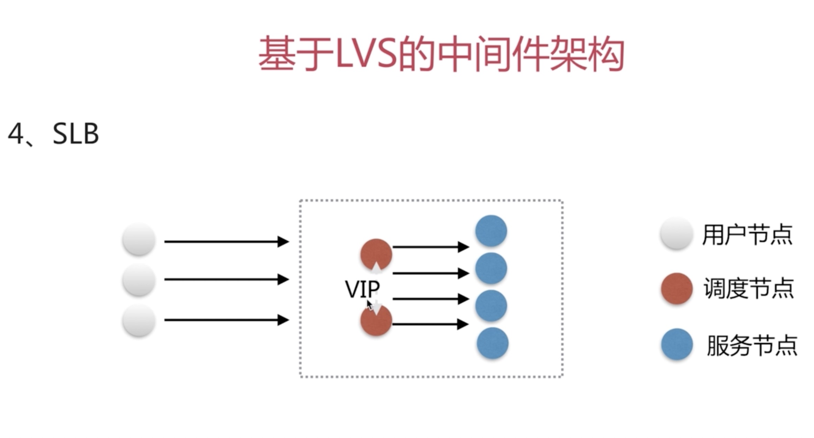
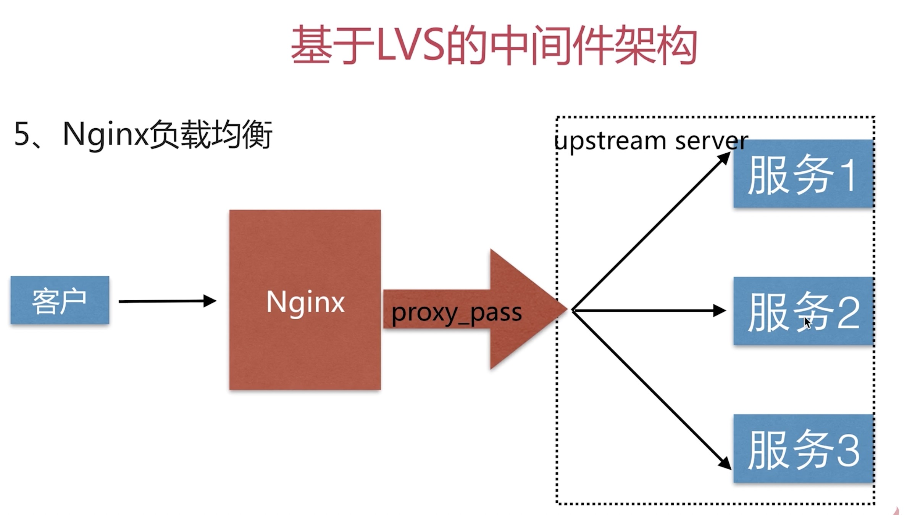
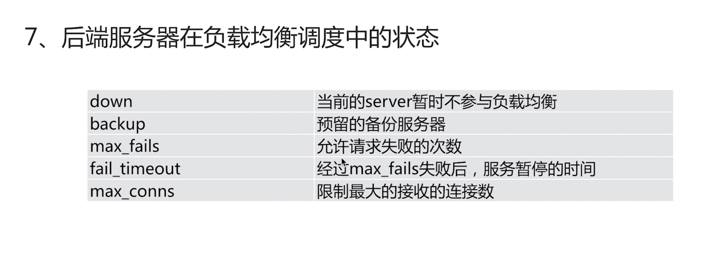
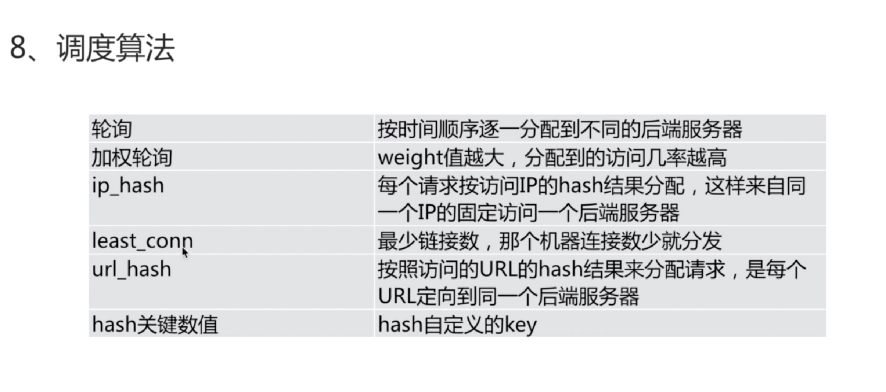

- 资料：
> [理论](https://zhuanlan.zhihu.com/p/34943332)
> [实践](https://juejin.im/post/6844904129987526663#comments)
> [实践](https://juejin.im/post/6844904135951646733)
> [nginx中文文档](https://www.nginx.cn/doc/)

# Nginx
>nginx学习：“Nginx是一款轻量级的HTTP服务器，采用事件驱动的异步非阻塞处理方式框架，这让其具有极好的IO性能，时常用于服务端的反向代理和负载均衡。

>自我了解：跨域。

>学习了解：是一个开源可靠且高性能的 http 中间件，代理服务

>中间件概念：连接两个独立应用程序或独立系统的软件

>优势：功能是企业最长常使用和需要的。轻量级(功能模块少，代码模块少)，高性能，多路IO复用（ epoll 模型）

### 安装nginx

安装：稳定版
yum -y install nginx

基本参数使用：

- 1.安装目录：
rpm -ql nginx
etc目录：核心配置
usr目录：用户
var目录：

- 2.编译参数：
- 3.Nginx 基本配置语法

- 反向代理：代购。

####  环境配置确认：四项确认，两项安装，一次初始化
四项确认：
- 1、确认系统网络 ping www.baidu.com
- 2、确认yum可用 yum list|grep gcc
- 3、确认关闭iptables规则 
iptables -L 查看是否有规则 
iptables -F 关闭规则
保险做法：
iptables -t net -L 查表规则
iptables -t net -F
- 4、确认停用selinux 
getenforce 查看是否开启
setenforce 0 关闭

两项安装：库安装
yum -y install gcc gcc-c++ autoconf pcre pcre-devel make automake
yum -y install wget httpd-tools vim

一次初始化：在opt目录下创建文件
cd /opt: mkdir app download logs work backup
app 代码目录
download 下载的源码目录
logs 自定义日志管理
work shell 脚本
backup 文件备份

### 云服务器环境搭建
- 链接远程服务器：
- 1.ssh root@47.97.64.134
- 2.输入密码 @

- server start nginx 启动服务

- nginx -s reload 重新加载

- nginx -t检查配置

- nginx -s stop 关闭
- ss -luntp 正在启用的服务器端口

- nginx.conf是典型的分段配置文件

### nginx虚拟主机基于多端口配置：
- ss -luntp 正在启用的服务器端口,不与现有使用的端口冲突
- nginx.conf 文件添加对应的端口配置
- 阿里云需要在 网络与安全->安全组里申请端口

### Nginx虚拟主机基于host域名的配置(本地)：
- mac：需要权限，sudo su -
- vim etc/hosts 编辑hosts问题，添加域名
- sudo vi /etc/hosts
- ping 对应的域名是否联通
- 配置 nginx.conf 文件

### 日志类型
error.log :错误状态
access_log:访问状态
配置 nginx.conf 文件 字段：log_format main 信息，
配置 log_format main 变量类型：
http请求变量：arg_PARAMETER, http_HEADER, sent_http_HEADER
内置变量： Nginx 内置变量
自定义变量：自己定义

### nginx 模块
- nginx官方模块：源码包默认携带的模块
- nginx第三方模块：非nginx官方的
- nginx -V 可以查看到携带的模块
Syntax: 配置语法
Default:默认配置
Content: 限制范围

### http_stub_status_module 模块:Nginx的客户端状态
Syntax: stub_status; 输入字段，直接打开功能
Default: -;没有默认配置
Content: server,location; 范围限制在 server 和 location 中
location /mystatus {
    stub_status;
}

### random_index 模块:目录中选择一个随机主页
Syntax: random_index on | off;
Default:random_index off;
Content: location
location / {
  root   /opt/app/code1;
  random_index on;
  #index  index.html index.htm;
}

### sub_module 模块:HTTP内容替换
- http_sub_module 

- sub_filter
Syntax: sub_filter string replacement; string 表示替换的内容， replacement 替换后的内容对象
Default: ——;
Content: http, server, location; 在http下面，可以对多个server进行替换
location / {
  root   /opt/app/code1;
  index  index.html index.htm;
  sub_filter '<a>ni hao' '<a>NI HAO';  把html页面中 '<a>ni hao' 替换成'<a>NI HAO'
}
>ps:注意清理浏览器缓存或者强制刷新
- sub_filter_once
<!-- 匹配html代码第一个还是全部 on:第一个 off:全部 -->
Syntax: sub_filter_once on|off;
Default: sub_filter_once on;
Content: http, server, location;

- sub_filter_last_modified
<!-- 校验内容是否有变更：主要用于缓存 -->
Syntax: sub_filter_last_modified on|off;
Default: sub_filter_last_modified off;
Content: http, server, location;

### Nginx 对请求限制
- 链接频率的限制：limit_conn_module
- 请求频率的限制：limit_req_module

### 链接限制
Syntax: limit_conn_zone key zone=name:size;
Default: -;
Content: http;

Syntax: limit_conn zone number;
Default: -;
Content: http, server, location;

### 请求限制
Syntax: limit_req_zone key zone=name:size rate=rate;
Default: -;
Content: http;

Syntax: limit_req zone=name[burst=number][nodelay];
Default: -;
Content: http, server, location;

### http_access_module:访问控制
Syntax: allow address | CIDR | unix: | all;
Default: -;
Content: http, server, location, limit_except;

Syntax: deny address | CIDR | unix: | all;
Default: -;
Content: http, server, location, limit_except;
- 局限性：中间层有代理，识别不到真正的客户端ip地址
- 解决办法：
- 方法一：http_x_forwarded_for = Client IP,Proxy(1)IP,Proxy(2)IP,Proxy(3)IP
- 方法二：结合geo模块
- 方法三：通过http自定义变量传递

### http_auth_basic_module: nginx用户登录认证
<!-- 该模块可以使你使用用户名和密码基于 HTTP 基本认证方法来保护你的站点或其部分内容。 -->
Syntax: auth_basic string | off;
Default: auth_basic off;
Content: http, server, location, limit_except;

<!-- 存储用户账号密码的文件 -->
Syntax: auth_basic_usr_file file; 
Default: -;
Content: http, server, location, limit_except;
- 局限性：用户信息依赖文件方式，操作管理机械，效率低下
- 解决方式：
- 方法一：nginx结合LUA实现高效验证
- 方法二：nginx和 LDAP 打通，利用 http_auth_ldap 模块

## 场景实践篇

### 静态资源WEB服务
- 静态资源类型：js，html，css，图片，视频，文件，

- 文件读取 sendfile
Syntax: sendfile on | off; 
Default: sendfile off;
Content: http, server, location, if in location;

>ps:扩展 with_file_aio 异步文件读取

- 优化网络包传输效率 tcp_nopush
Syntax: tcp_nopush on | off; 
Default: tcp_nopush off;
Content: http, server, location;

- 实时发送：tcp_ondelay
Syntax: tcp_ondelay on | off; 
Default: tcp_ondelay off;
Content: http, server, location;
- 作用：keepalive链接下，提高网络包的传输实时性

- 配置语法：压缩
Syntax: gzip on | off; 
Default: gzip off;
Content: http, server, location, if in location;

- 压缩比例
Syntax: gzip_comp_level level; 
Default: gzip_comp_level 1;
Content: http, server, location;
> ps：压缩需要消耗服务端的性能，合理配置比例

- 压缩的http版本
Syntax: gzip_http_version 1.0| 1.1; 
Default: gzip_http_version 1.1;
Content: http, server, location;

- 扩展Nginx 压缩模块：
- http_gzip_static_module - 预读gzip功能
- 读取是否有现成的压缩文件

- http_gunzip_module -应用支持gunzip的压缩方式
> ps:很少用到，在gzip失效的情况下用

### 浏览器缓存
- HTTP协议定义的缓存机制（如：Expires，Cache-control 等）
- 浏览器无缓存：浏览器发起请求——> 无缓存 ——> 请求 WEB 服务器 ——> 请求响应，协商——>呈现
- 浏览器有缓存：浏览器发起请求——> 有缓存 ——> 校验过期。。。 ——> 呈现
- 配置语法 - expires
Syntax: expires[modified]time; expires epoch |max|off;
Default: expires off;
Content: http, server, location,if in location;

- 跨站访问
- 为什么浏览器禁止跨站访问：不安全，容易出现跨站脚本攻击（CSRF）
- 为什么需要打开：服务上的需要 Access-Control-Allow-Origin
- 语法配置:允许哪个站点跨站访问
Syntax: add_header name value[always];
Default: -;
Content: http, server, location,if in location;

- 防盗链
- 目的：防止资源被盗用
- 使用 referer 信息判断

### 代理服务
- 按应用场景：正向代理，反向代理
- 正向代理：翻墙，代理对象是客户端，为客户端服务(不能支持https协议)
- 反向代理：代理对象是服务端，为服务端服务

- Nginx支持的代理协议：HTTP, websocket, HTTPS（深度学习的）, GRPC 等等

location / {
  #跳转配置 proxy_redirect 在后端返回301的时候需要做一些调试
  proxy_pass http://47.97.64.134:80;
  proxy_redirect default;

  #发送给后端设置的头信息，发送host 真实用户ip信息等
  proxy_set_header Host $http_host;
  proxy_set_header X-Real-IP $remote_addr;
  
  #超时限制
  proxy_connect_timeout 30;
  proxy_send_timeout 60;
  proxy_read_timeout 60;
  
  #缓冲区配置
  proxy_buffer_size 32k;
  proxy_buffering on;
  proxy_buffers 4 128k;
  proxy_busy_buffers_size 256k;
  proxy_max_temp_file_size 256k;
}
- 缓存服务：目的减少后端的压力
- 客户端，服务端，代理端，都能缓存
- nginx清除缓存：rm -rf 直接删除缓存文件，第三方模块ngx_cache_purge
- 实现部分页面不缓存问题：
#### 不能缓存的url路径
if ($request_uri ~ ^/(url3|login|register|password\/reset)) {
    set $cookie_nocache 1;
}
location / {
    proxy_no_cache $cookie_nocache $arg_nocache $arg_comment;
    proxy_no_cache $http_pragma $http_authorization;
}
-  缓存命中分析：
- 方式一：通过设置 response 的头信息 Nginx-Cache：add_header Nginx-Cache "$upstream_cache_status";
- 方式二：通过设置 log_format，打印日志分析

- 缓存命中率：HIT次数 / 总请求次数
- 实现方式：分析 Nginx里的 Access 日志：awk命令

- 大文件的分片请求
Syntax: slice size;
Default:slice 0;
Content: http, server, location;

### 实现 ws 代理（websocket）
- websocket 实现在 HTTP 链接的基础上，并通过 HTTP 中的 Upgrade 协议头将链接从 HTTP 升级到 Websocket 。这样就可以实现多次双向通讯，直到协议被关闭

- 客户端测试工具：wscat
- nginx 实现 websocket 场景
- 1、部署 nodejs 环境
- 2、配置 nginx 配置文件
- 3、测试
> ps 阿里云服务器安装 ws 和 wscat 有问题。。实现失败
### 负载均衡调度器SLB
- 切换到能用到服务器
范围分类
- GSLB：影响范围国家到省级为单位做负载均衡

- SLB：影响范围小，但是实时行高

- 网络模型分类
- 四层负载均衡： TCP/IP 协议层负载均衡，包的转发实现负载均衡
- 七层负载均衡：应用层负载均衡，可以改写 http信息，安全应用规则控制，转发等等，比四层能做更多的事

- 实现方式
- 通过 proxy_pass 转发到 upstream_server（服务器组） 组实现。

配置语法:
Syntax: upstream name {...};
Default:-;
Content: http;

- upstream 参数：

## nginx 深入了解

### 动静分离
- 通过中间件，将动态请求和静态请求分离

### nginx rewrite 规则
- 实现 url 重写 以及重定向：依赖正则
- 场景：
- 1、url访问跳转，支持开发设计，页面跳转，兼容性支持，展示效果（url精简）等
- 2、SEO 优化 
- 3、维护：后台维护，流量转发等
- 4、安全：伪静态
- rewrite 配置:regex 匹配需要改写到正则或者路径，replacement 需要替换的
- Syntax: rewrite regex replacement [flag];
- Default:-;
- Content: server, location, if;

- eg： rewrite ^(.*)$ /pages/maintain.html break; 
- 把所有请求，重定向到 /pages/maintain.html 页面

- 终端命令测试正则，pcretest

- 规则中的 flag参数：
- last 停止 rewrite 检测：last会新建请求，带上新的uri 
- break 停止 rewrite 检测：匹配到会去访问目录下查找文件，找不到返回 404
- redirect 返回 302 临时重定向，地址栏会显示跳转后的地址：会重新发起请求
- permanent 返回 301 永久重定向，地址栏会显示跳转后的地址：不会重新发起请求

### secure_link_module 模块
- 1、指定并允许检查请求的链接的真实性以及保护资源免遭未经授权的访问
- 2、限制链接生效周期
- 配置语法一:
- Syntax: secure_link expression;
- Default: -;
- Content: http, server, location;

- 配置语法二:
- Syntax: secure_link md5 expression;
- Default: -;
- Content: http, server, location;

## nginx 架构篇
### nginx 常见问题

#### 相同 server_name 多个虚拟主机优先级访问：同域名，同端口
- 按照文件顺序读取，先读取先访问。

#### location 匹配优先级
- = 进行普通字符精确匹配，也就是完全匹配 优先级1
- ^~ 表示普通字符匹配，使用前缀匹配 优先级1
- ～\~* 表示执行一个正则匹配（） 优先级2

#### try_files 使用
- 按顺序检查文件是否存在
- 场景：去查找缓存文件存不存在，不存在才去做别的
- 寻找 uri 存不存在，不存在， 重定向 uri/ 查找文件存不存在  
location / {
    try_files $uri $uri/ /index.php
}

- nginx 的 alias 和 root 区别
- 用什么方法传递用户真实IP
