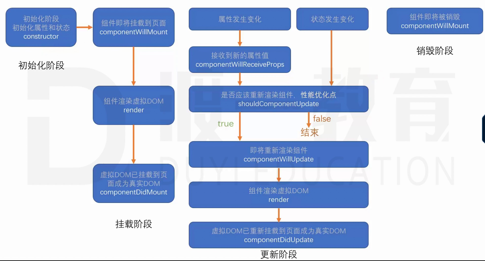
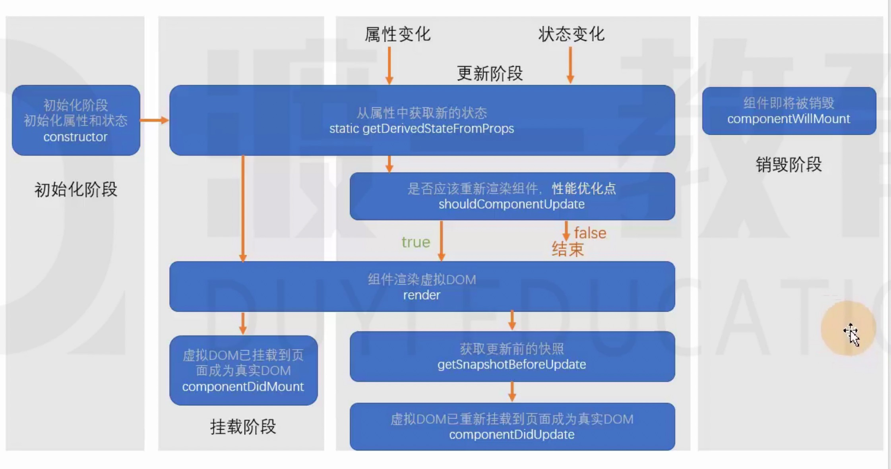

# 令人心动的 React 开始拉
> 由 facebook 研发的，解决 UI 复杂度的开源 JavaScript 项目
## html 页面 js 引入
```js
// <!-- crossorigin 跨域报错可以看到详细信息 -->
// <!-- 核心库 与宿主环境无关 -->
// <!-- 提供对象： React.createElement:创建react 元素 -->
<script src="https://unpkg.com/react@16/umd/react.development.js" crossorigin></script>
// <!-- 依赖核心库，将核心库的功能与页面结合 将react元素生成真实的dom-->
<script src="https://unpkg.com/react-dom@16/umd/react-dom.development.js" crossorigin></script>
// <!-- JSX的转译babel -->
<script src="https://unpkg.com/babel-standalone@6/babel.min.js" crossorigin></script>
```

## React.createElement()
- 创建一个 React 元素。称作虚拟dom，本质是一个对象（内置组件）
- 参数1：元素类型，如果是字符串，则是一个普通的 html 元素
- 参数2：元素的属性，一个对象，如class，id等等
- 参数3：元素的字节点

### ReactDOM.render()
- 将 React.createElement() 创建的虚拟节点，编译成真实的dom
- 参数1:虚拟节点
- 参数2：挂载的节点
```js
// 创建一个 span 元素
let span = React.createElement('span',{}, '我是一个span')
// 创建 h1元素
let h1 = React.createElement('h1', {
    title:'h1'
}, '321', span)
// 以上都是 React 元素
// 生成真实节点
ReactDOM.render(h1,document.getElementById('reactRoot'))
```

### JSX 语法如何转化成真实的 DOM
- JS的扩展语法，需要使用 babel 进行转译，
- 目的：方便我们书写代码

<script type="text/babel">
    let h1 = <h1>我是和<span>我是一个span</span></h1>
    ReactDOM.render(h1,document.getElementById('reactRoot'))
</script>

### 使用脚手架搭建工程
- 官方：create-react-app
- 第三方：next.js, umijs
- yarn源安装：yarn create react-app 工程名


### 开发环境配置
- VScode emmet配置：快速写JSX
- settings.json 文件中
```json
"emmet.includeLanguages": {
    "javascript":"javascriptreact"
  }
```
- vscode插件：VS Code ES7 React/Redux/React-Native/JS snippets
- 目的：快速编写代码
- 浏览器插件：React Develooper Tools
- 目的：方便调试


## 开发

## 什么是JSX
- Facebook 起草的 jS 扩展语法
- 本质是一个 JS 对象，会被 babel 编译，最终被转换成 createElement
- 每个 JSX 表达式，有且仅有一个根节点
  - React.Fragment 解决需要多节点问题
- 每个 JSX 元素必须结束（XML规范）

### 在 JSX 中嵌入表达式：{}
- 将表达式作为内容的一部分
 - null undefind false 不会显示
 - 不能放置普通对象作为子元素
 - 可以放置 react 元素对象，style 对象
- 将表达式作为元素属性
- 属性使用小驼峰命名法
- 添加class：className
- 防止注入攻击
 - 自动编码
 - dangerouslySetInnerHTML
```js
let a = 111,
    b = 222,
    arr =[ 1, false, null, undefined, 3 ]
const div = (<div>
  {/* 不会产生任何输出 */}
  <p>{ null}</p>
  <p>{ undefined }</p>
  <p>{ false }</p>
  <p>{ true }</p>
  <p>0</p>
  <p>{Boolean(0)}</p>
  <h1 className={cls}>{a} * {b} = {a * b}</h1>
  <h1>{ arr }</h1>
</div>)
ReactDOM.render(div,document.getElementById('root'))
```
```js
// 直接插入dom元素
const conent = '<h1>asd</h1>'
const div = (
  <div  dangerouslySetInnerHTML={{
    __html:content
  }}>
  </div>
)
ReactDOM.render(div,document.getElementById('root'))
```

### 元素的不可变性
- 虽然 JSX 是一个对象，但是该对象的所有属性不可更改
- 如果确实需要更改属性，需要重新创建 JSX 元素，重新渲染
 - 因为改变的是 React 对象，不是真实的dom，效率是非常快的

### React中的哲学：数据属于谁，谁才有权利改动。

## 组件
- 组件大驼峰规则
 - 如果首字母不大写，会解析成普通的 React 元素，会报错 
- 函数组件：返回一个 react 元素
- 类组件：必须继承 React.Component,提供 render函数，返回 react 元素
> 未来：推荐使用函数组件（新增的hooks）。目的：消除 this


### 组件属性：
- 对于函数组件：属性会作为一个对象的属性。传递给函数的参数
- 对于类组件：属性会作为一个对象的属性，传递给构造函数的参数
> 注意：使用小驼峰命名，组件不能改变自身的属性（传入的属性做了限制）。


### 组件状态：
- 组件可以自行维护的数据
- 组件状态仅在组件中有效
- 状态（state）：本质上是一个类数组的属性，是一个对象


### 组件状态更新：
- 不能直接改变状态：因为 React 无法监控到状态发生了变化
- 必须使用 this.setState({}) 改变状态
- 一旦调用了 this.setState 相同数据进行覆盖，会导致组件重新渲染


### 组件中的数据：
- props：该数据是由组件使用者传递的数据，所有权不属于组件自身，因此组件无法改变该数据
- state：组件自身创建，所有权属于自身，组件自身有权改变。


## 事件：这种操作，我爱了
- 在 React中，组件的事件，本质就是一个属性
- 按照之前 React 对组件对约定， 由于事件本质上是一个属性：也需要用小驼峰命名
- 内置组件事件与DOM元素事件保持一致
- 如果没有特殊处理，在事件处理函数中 this 指向 undefined
- 问题：内置组件如何获取this
  - 使用 bind 函数绑定 this
  - 使用箭头函数（最舒服的写法）：变成一个属性，在对象上，不在原型上了

## setState
- setSate 对状态对改变，**可能**是异步的
> 如果改变状态对代码处于某个HTML元素的事件中，则其是异步的，否则是同步
- 如果希望在状态改变之后继续操作，这利用setSate 的第二个参数，回调函数，
```js
this.state.n = 1
this.setState({
  n: this.state.n + 1
}, () =>{
  console.log(his.state.n) //2
})
console.log(his.state.n) // 1
```
- 需要多次改变状态：setSate的第一个参数可以是一个回调函数
- 如果遇到某个事件中，需要多次同步修改状态，需要使用函数的方式得到最新状态
```js
this.setState(cur=>{
  //参数 cur 表示当前状态
  // 该函数的返回结果，会混合（覆盖）掉之前的状态
  // 该函数异步执行
  return {
    n: cur.n + 1
  }
})
```
- 实践：
 - 1、把所有 setState 当作异步的
 - 2、永远不要信任 setState 调用之后的状态
 - 3、如果要使用改变之后的状态，需要使用回调函数（setState第二个参数）
 - 4、如果新的状态需要根据之前的状态进行运算，使用函数的方式改变状态（setState第一个参数，作为函数使用）

- React 会对异步的 setState 进行优化，将多次的 setState 进行合并（将多次状态改变完成后，再统一对 state 进行改变，然后触发 render）

## 生命周期
- 生命周期仅存在类组件中，函数组件每次调用都是重新运行函数，旧对组件即刻被销毁

### 旧版生命周期： React < 16.0.0


### 初始化阶段
1. constructor：初始化阶段，初始化属性和状态
  1. 同一个组件对象只会创建一次
  2. 不能在第一次挂载页面之前，调用 setState。

2. componentWillMount：组件即将挂载到页面 新版移除
  1. 正常情况下，和构造函数一样，它只会运行一次
  2. 可以使用 setState ，但是为了避免 bug ，不允许使用，因为在某些情况下，该函数会调用多次

3. **render** 组件渲染虚拟 DOM
  1. 返回的 React 元素会被挂载到虚拟 DOM 树中，最终渲染到页面的真实 DOM 中
  2. render 可能不止运行一次，只要需要重新渲染，就会重新执行
  3. 严禁使用 setState

4. **componentDidMount** 虚拟 DOM 挂载，成为真实 DOM之前
  1. 只会执行一次，挂载完成 
  2. 可以使用 setState
  3. 通常情况下，会将网络请求，定时器等等操作写在这里

> 1 - 4 挂载阶段完成

#### 更新阶段 状态改变，属性更新
5. componentWillReceiveProps 接收到新的属性值 新版移除
  1. 即将接收新的属性值
  2. 参数为新的属性对象
  3. 该函数可能会导致一些bug，不推荐使用（状态和属性混乱使用，导致数据出处不明确）

6. **shouldComponentUpdata** 是否重新渲染组件 性能优化点
  1. 指示 React 是否要重新渲染该组件，通过返回 true 和 false 来指定，
  2. 默认 为 true
 
7. componentWillUpdate 即将重新渲染组件 新版移除
  1. 组件即将被重新渲染

8. componentDidUpdete 虚拟 DOM 挂载，成为真实 DOM
  1. 往往在该组件中使用 DOM 操作，改变元素


#### 销毁阶段
9. **componentWillUnMount**
  1. 组件从 DOM 树移除的时候触发
  2. 通常在该函数中，销毁一些组件依赖的资源，比如计时器


### 新版生命周期 React > 16.0.0

constructor -> static getDerivedStateFromProps -> componentDidMount 挂载三步走

#### 初始化阶段
1. constructor：初始化阶段，初始化属性和状态
  1. 同一个组件对象只会创建一次
  2. 不能在第一次挂载页面之前，调用 setState。

#### 更新阶段 状态改变，属性更新

2. static getDerivedStateFromProps 从属性中获取新的状态
  1. 通过参数可以获取新的属性和状态
  2. 该函数是静态的
  3. 该函数返回值会覆盖掉组件的状态
  4. 该函数几乎没啥用

3. **shouldComponentUpdata** 是否要重新渲染该组件  性能优化点
  1. 指示 React 是否要重新渲染该组件，通过返回 true 和 false 来指定，
  2. 默认 为 true
 
4. **render** 组件渲染虚拟 DOM
  1. 返回的 React 元素会被挂载到虚拟 DOM 树中，最终渲染到页面的真实 DOM 中
  2. render 可能不止运行一次，只要需要重新渲染，就会重新执行
  3. 严禁使用 setState

5. **componentDidMount** 挂载
  1. 只会执行一次，挂载完成 
  2. 可以使用 setState
  3. 通常情况下，会将网络请求，定时器等等操作写在这里(**副作用处理**)

6. getSnapshotBeforeUptate 获取更新时候的快照
  1. 真实的 DOM 构建完成，还没有渲染到页面中
  2. 在该函数中，通常用于实现一些**附加的 DOM 操作**
  3. 该函数的返回值，会作为 componentDidUpdete 钩子函数的第三个参数

7. componentDidUpdete  虚拟 DOM 挂载，成为真实 DOM
  1. 往往在该组件中使用 DOM 操作，改变元素（**副作用处理**）

#### 销毁阶段
8. **componentWillUnMount**
  1. 组件从 DOM 树移除的时候触发
  2. 通常在该函数中，销毁一些组件依赖的资源，比如计时器（**副作用处理**）


## 表单
- 受控组件和非受控组件
 - 受控组件：组件的使用者，有能力完全控制该组件的行为，无状态组件，
 - 非受控组件：组件的使用者，没有能力控制组件的行为和内容，状态组件


## ref
- 场景：希望直接使用 DOM 元素的方法，或者自定义组件的方法 
1. ref 作用于内置 html 组件，得到的将是真实的 dom 对象
2. ref 作用于类组件，得到的将是类的实列
3. ref不能作用于函数组件
- **谨慎使用 ref**
>ps：ref 不再推荐使用字符串赋值，字符串赋值的方式将来可能会被移除，目前推荐使用对象，或者函数
- **对象** 通过 React.crateRef() 函数创建
```js
import React, { Component } from 'react'

export default class MyRef extends Component {
  state = {
    val: '',
    inpRef: React.createRef()//方式一
    // inpRef: {  //方式二
    //   current: null
    // }
  }
  render() {
    return (
      <div>
        <input ref={ this.state.inpRef} type="text" value={this.state.val} onChange={e => {
          this.setState({
            val: e.target.value
          })
        }}/>
        <button onClick={() => {
          console.log(this.state.inpRef.current)
        }}>聚焦</button>
      </div>
    )
  }
}
```
- **函数**
  -  componentDidMount事件中（挂载完成） 时候可以使用 ref 了
  -  ref 的值发生了变动，旧的函数被新的函数替代，会被调用了两次
```js
import React, { Component } from 'react'

export default class MyRef extends Component {
  state = {
    val: '',
  }
  render() {
    return (
      <div>
        <input ref={ref=>{ ... }} type="text" value={this.state.val} onChange={e => {
          this.setState({
            val: e.target.value
          })
        }}/>
        <button onClick={() => {
        }}>聚焦</button>
      </div>
    )
  }
}
```

## Context：上下文：表示做一些事的环境
- React 中上下文的特点
  1. 当某个组件创建了上下文后，上下文中的数据，会被所以后代组件共享
  2. 如果某个组件依赖上下文，会导致组件不再纯粹（外部数据仅来自于props）
  3. 一般情况下，用于第三方组件（通用组件）

### 旧API

> 只有类组件才可以创建上下文
- **创建上下文**
  1. 给类组件书写静态属性 childContextTypes，使用该属性对上下文中的数据类型进行约束
  2. 添加实例方法 getChildContext，该方法返回的对象，即为上下文中的数据，该数据必须满足类型约束，该方法会在 render 之后运行，（第一次会在 constructor 时候运行）

- **使用上下文**
- 要求：如果要使用上下文中的数据，组件必须有一个静态属性 contextTypes，该属性描述了需要获取的上下文中的数据类型
  1. 可以在组件的构造函数中，通过第二个参数，获取上下文数据
  2. **从组件的 coontext 属性中获取**
  3. 在函数组件中，通过第二个参数，获取上下文数据

- **上下文中的数据变化**：上下文中的数据不可以直接变化，最终都是状态改变
> ps: 如果上下文重复，组件会拿到最近一级的上下文（就近原则）


### 新的API(真像 vue bus)

- 旧版 API 存在效率和滥用问题
- **创建上下文**
  1. 上下文是一个独立于组件的对象，该对象通过 React.createCoontext(默认值) 创建，返回的是一个包含两个属性的对象
    1. Provider属性：生产者，一个组件，该组件会创建一个上下文
      1. 该属性有一个 value 属性，通过该属性，可以为其他数据赋值
      2. 同一个 Provider，不要用到多个组件，如果需要在其他组件中使用该数据，应该考虑将数据提升到更高到层次
    2. Comsumer属性：消费者，

- **使用上下文**
  1. 在类组件中，直接使用 this.context 获取上下文数据
    1. 要求：必须拥有静态属性 contextType，应赋值为创建的上下文对象
  2. 在函数组件中，需要使用 Comsumer 来获取上下文数据（类也可以使用这种方式）
    1. Comsumer 是一个组件
    2. 它到子节点。是一个函数（它的 props.children 需要传递一个函数）

- **注意细节**
  1. 如果，上下文提供者（Context.Provider）中的 value 更新，会导致使用该上下文的所有后代元素全部重新渲染。无论该子元素是否有优化（无论 shoouldComponentUpdata 函数返回什么结果（强制更新））

## React 中的事件
- 这里的事件： React 内置的 DOM 组件中的事件
1. 给 document 注册事件
2. 几乎所有的元素事件处理，均在 document 的事件中处理（事件最终会冒泡到 document）
  1. 对于不冒泡的事件，直接在元素上监听，
3. 在 doocument 的事件处理，React 会根据虚拟 DOM 树的完成事件函数的调用
4. React 的事件参数 e， 并非真实的事件参数。是一个合成的对象，类似于真实的 DOM 的事件参数 
  1. stopPropagation,阻止事件在虚拟 DOM 树中的冒泡
  2. nativeEvent，可以得到真实的 DOM 事件对象
  3. 为了提高效率，React 使用事件对象池来处理事件对象
**注意**
  1. 如果给真实的 DOM 的事件，并且阻止了冒泡。则会导致 React 事件无法触发 
  2. 如果给真实的 DOM 的事件， 会先于 React 事件运行
  3. 通过 React 的事件中阻止事件冒泡，无法阻止真实事件
  4. 可以通过 nativeEvent.stopImmediatePropagatioon()，阻止 document 上剩余事件的执行
  5. 在事件处理程序中，不要异步使用事件对象，如果一定要使用，需要调用 e.persist 函数持久化事件对象。


## 渲染原理：React 元素 => React 节点 => UI
- React 元素：React Element，通过 React.createElement 创建（语法糖：JSX）
  - 例如
  - ```<div><h1>标题</h1></div>```
  - ```<app />```
- React 节点：专门用于渲染到 UI 界面的对象，React 会通过 React 元素，创建 React 节点，ReactDOM 一定是通过 React 节点来进行渲染

- 节点类型
  1. React DOM节点：创建该节点的 React 元素类型是一个字符串
  2. React 组件节点：创建该节点的 React 元素类型是一个函数或者是类
  3. React 文本节点：由字符串创建
  4. React 空节点：由 null，undefined，false
  5. React 数组节点：节点由一个数组创建

### 首次渲染（新节点渲染）
1. 通过参数的值创建节点
2. 根据不同的节点，做不同的事
  1. 文本节点：通过 document.creatTextNode 创建真实节点
  2. 空节点：什么都不做
  3. 数组节点：遍历数组，将数组每一项递归创建节点（回到第一步返回操作 ，知道遍历结束）
  4. DOM 节点：通过 document.createElement 创建真实的 DOM 对象，然后立即设置该真实 DOM 元素的各种属性，然后遍历对应的 React 元素的 children 属性，递归操作（回到第一步进行反复操作，直到遍历结束）
  5. 组件节点
    1. 函数组件：调用函数（该函数必须返回一个可以生成节点的内容），将该函数的返回结果递归生成节点（回到第一步进行反复操作，直到遍历结束）
    2. 类组件：
      1. 创建该类的实例
      2. 立即调用对象的生命周期方法：static getDerivedStateFromProps
      3. 运行该对象的 render 方法，拿到节点对象（回到第一步进行反复操作，直到遍历结束）
      4. 将该组件的 componentDidMount 加入到执行队列（先进先出，先进先执行），当整个虚拟 DOM 树全部构建完毕，并且将真实的 DOM 对象加入到容器后，执行该队列
3. 生成出虚拟 DOM 树之后，将该树保存起来，以便后续使用
4. 将之前生成的真实 DOM 对象，加到容器中。


### 更新节点

- 如果调用的是 ReactDOM.render，进入根节点的**对比（diff）更新**
- 如果调用的是 setState
  1. 运行生命周期函数 static getDerivedStateFromProps
  2. 运行 shouldComponentUpdate，如果该函数返回 false，终止当前流程
  3. 运行 render，得到一个新的节点，进入该新节点的**对比更新**
  4. 将生命周期函数 getSnapshotBeforeUpdate 加入执行队列，以待将来执行
  5. 将生命周期函数 componentDidUpdate 加入执行队列，以待将来执行 （和 getSnapshotBeforeUpdate 加入的队列不同）
- 后续步骤
  1. 完成真实DOM的更新
  2. 依次调用执行队列中的 componentDidmount
  3. 依次调用执行队列中的 getSnapshotBeforeUpdate
  4. 依次调用执行队列中的 componentDidUpdate
  5. 依次调用执行队列中的 componentWillUnmount

#### 对比更新
- 将新产生的节点，对比之前虚拟DOM中的节点，发现差异，完成更新
- 问题：对比之前DOM树中的哪个节点
- React 为了提高对比效率，做出以下假设
  1. 假设节点不会出现层次的移动（对比时，直接找到旧树中对应位置的节点进行对比）
  2. 不同节点类型会产生不同的结构
    1. 相同节点类型：节点本身类型相同，如果是由 React 元素生成，type 值还必须一致
    2. 其他的，都属于不相同的节点类型
  3. 多个兄弟通过唯一标识（key）来确定对比的新节点
    1. key 值的作用：用于通过旧节点，找到对应的新节点，如果某个旧节点有 key 值，则更新时会寻找相同层级中的相同 key 值的节点，进行对比。
#### 找到了对比目标
- 判断节点是否一致

- **一致**
- 根据不同的节点类型，做不同的事情
  1. 空节点：不做任何事情
  2. **DOM节点**
    1. 直接重用之前的真实DOM对象
    2. 将其属性的变化记录下来，以待将来统一完成更新（现在不会真的变化）
    3. 遍历该新的 React 元素的子元素，**递归对比更新**
  3. **文本节点**
    1. 直接重用之前的真实DOM对象
    2. 将新的文本变化记录下来，将来统一完成更新
  4. **组件节点**
  5. **函数节点**
    1. 重新调用函数，得到一个节点对象，进入**递归对比更新**
  6. **类组件**
    1. 重用之前的实例
    2. 调用生命周期方法 getDerivedStateFromProps
    3. 调用生命周期方法 shouldComponentUpdate，如果该函数返回 false，终止
    4. 运行 render，得到新的节点对象，进入**递归对比更新**
    5. 将该对象的 getSnapshotBeforeUpdate 加入队列
    5. 将该对象的 componentDidUpdate 加入队列
  7. **数组节点**
    1. 遍历数组进行**递归对比更新**


- **不一致** 
-  整体上，卸载旧的节点，全新创建新的节点
  1. **创建新节点**
  2. **卸载旧节点**
    1. **文本节点，DOM节点，数组节点，空节点，函数组件节点**：直接放弃该节点，如果节点有子节点，递归卸载节点
    2. **组件节点**
      1. 直接放弃该节点
      2. 调用该节点的 componentWillUnMount 函数 
      3. 递归卸载子节点
  3. 进入新节点的挂载流程

#### 没有找到对比目标

- 新的DOM树中有节点被删除
- 新的DOM树中有节点添加
- 创建新加入的节点
- 卸载多余的旧节点

## HOOK:真香
HOOK：React16.8.0之后出现
组件：无状态组件（函数组件），类组件
类组件的麻烦：
1. this 指向问题
2. 繁琐的生命周期
3. 其他问题

- HOOK 专门用于增强函数组件的功能（HOOK 在类组件中不能使用），理论上可以成为类组件的替代品

- HOOK(钩子)本质上是一个函数（命名上总以 use 开头），该函数可以挂载任何功能

- HOOK 总类：
  1. useState
  2. useEffect
  3. 其他...

### State Hook
[useState API](./react-learn/src/component/HOOK/UseState.js)
- 是一个在函数组件中使用的函数（useState），用于在函数中使用状态

- useState
  1. 函数有一个参数，整个参数的值表示状态的默认值
  2. 函数的返回值是一个数组，该数组有两项
    1. 第一项：当前状态的值（可原始值，可对象，最好原始值）
    2. 第二项：改变状态的函数
- 一个函数组件中可以有多个状态，这种做法有利于横向切割关注点
- 状态（是一个状态数组）表挂载在组件上，不会随函数执行而初始化，

- **注意细节**
  1. useState 最好写到函数起始位子，便于阅读
  2. useState 严禁出现在代码快（判断，循环）中
  3. useState 返回的函数（数组的第二项），引用不变（节约内存空间）
  4. 如果使用函数改变数据，若数据和之前一样，则不会重新渲染（Object.is 比较）
  5. 使用函数改变数据，传入的值不会和原来的数据进行合并，会直接替换
  6. 如果要实现强制刷新组件：
    1. 类组件：使用 forceUpdate 函数
    2. 函数组件：使用一个空对象的 useState 
  7. **如果某些状态直接没有必然联系。应分化为不同状态，而不要合并成一个对象**
  8. 和类组件的状态一样，函数组件中改变状态，可能是异步的（在 DOM 事件中），多个状态变化会合并，此时不能信任当前状态，如果状态变化使用到之前的状态，尽量传递函数


### Effect Hook
[useState API](./react-learn/src/component/HOOK/UseEffect.js)
- Effect Hook：用于函数组件中处理副作用
- 副作用：
  1. ajax 请求
  2. 计时器
  3. 其他异步操作
  4. 更改真实 DOM 对象
  5. 本地存储(localStorage)
  6. 其他会对外部产生影响的操作

- 函数：useEffect：
  1. 接收一个函数作为参数，作为副作用操作函数
  2. 副作用函数运行时间点：是在页面完成真实的 UI 渲染之后（执行是异步的，不会阻塞浏览器）
  3. 与类组件中 componentDidMount 和 componentDidUpdate 的区别
    1. componentDidMount 和 componentDidUpdate，更改了真实 DOM,但是用户还没看到更新
    2. useEffect 中的副作用函数，更改了真实 DOM，并且用户已经看到了 UI更新，
  4. 每个函数组件中，可以多次使用 useEffect，但是不要放入代码块中
  5. useEffect 中的副作用函数，可以用返回值，返回值必须是一个函数，处理副作用后的一些操作（**清理函数**）
    1. 该函数运行时间点：在每次运行副作用函数之前
    2. 首次渲染组件不会运行
    3. 组件被销毁时一定会运行
  6. useEffect函数，可以传递第二个参数
    1. 第二个参数是一个数组
    2. 数组中记录该副作用的依赖数据
    3. 当数组重新渲染后哦，只有依赖数据与上一次不一样，才会执行副作用函数
    4. 所以，当传递了依赖数据之后，如果数据没有发生变化
      1. 副作用函数仅在第一次渲染后运行
      2. 清理函数仅在卸载组件后运行
    5. 使用空数组作为依赖项：则副作用函数，仅在挂载的时候运行一次
    6. 副作用函数中，如果使用了函数上下文中的变量，由于闭包影响，会导致副作用函数中的变量不会实时变化

### 自定义 Hook
[useList](./react-learn/src/component/myHook/useList.js)
- 自定义 Hook：将一些常用的，跨越多个组件的 Hook 功能，抽离出去形成一个函数，该函数就是自定义 Hook 

### Reducer Hook 真好用！！！
[useReducer](./react-learn/src/component/myHook/useReducer.js)
[reducerHook](./react-learn/src/component/myHook/reducerHook.js)


### Context Hook
[UseContext](./react-learn/src/component/Hook/UseContext.js)
- 函数名：useContext
- 获取上下文数据
- 针对于 React.createCoontext ，创建上下文和使用上下文，会增加组件的嵌套。所以有了 useContext,
- 他减少了一层消费者（上下文的使用者）的嵌套
>疑问：自组件怎么获取 上下文对象

### Callback Hook
[UseCallback](./react-learn/src/component/Hook/UseCallback.js)
- 函数名：useCallback
- 通常用于性能优化
- 该函数有两个参数
  1. 函数，useCallback会固定该函数的引用，只要依赖没有发生改变，则始终返回该函数地址
  2. 记录依赖项
- 该函数返回固定的函数引用地址

### Memo Hook：相当于 vue 的计算属性
[UseMemo](./react-learn/src/component/Hook/UseMemo.js)
- 函数名：useMemo
- 用于保持一些比较稳定的数据，通常用于性能优化
- 保持高开销的计算结果
- **如果React元素本身的引用没发生变化，一定不会重新渲染**

### Ref Hook
[UseRef](./react-learn/src/component/Hook/UseRef.js)

- React.crateRef() 在函数组件中每次创建，都是一个新的 ref
- 在useRef的使用下，保证了每次都是使用一个相同的 ref
> 可以做很多优化，比如 全局变量（timer）固定

### ImperativeHandle Hook
- 函数组件中使用 ref 
- useImperativeHandle(ref,()=>{
  return {
    ... 需要的方法数据
  }
})

### layoutEffect
- 执行时间点：和类组件生命周期 componentDidMount,componentDidUpdate 一致
- 主要处理真实DOM的操作，和 useEffect 操作一致
- 尽量使用 useEffect 这样不会阻塞渲染，如果出现问题，再考虑 layoutEffect

### DebugValue Hook
- useDebugValue: 将某个数据显示到调试栏
- 如果创建的自定义 Hook 通用型比较高，可以进行选择使用 useDebugValue 方便调试
### 遵循 28 原则，使用最多的 Hook 还是 useState 和 useEffect

## React 动画：参考 vue 的动画
- React动画库：react-transition-group 
[react-transition-group](https://reactcommunity.org/react-transition-group/transition)
### CSSTransition
- 自定义样式，根据对应当样式名
- 当进入时，发生
  1. 为 CSSTransition 内部的 DOM 根元素添加样式 enter 
  2. 在下一帧（enter样式已经完全应用到了元素），立即为该元素添加样式 enter-active
  3. 当 timeout 结束后哦，去掉之前当样式，添加样式 enter-done

- 当退出时，发生
  1. 为 CSSTransition 内部的 DOM 根元素添加样式 exit
  2. 在下一帧（exit样式已经完全应用到了元素），立即为该元素添加样式 exit-active
  3. 当 timeout 结束后哦，去掉之前当样式，添加样式 exit-done
### . . . 具体官方操作学习


## React Router：参考 vue-router

- 无论是使用 Vue， 还是 React，开发单页面应用程序，可能只是该站点单一部分（某一个功能块）
- 一个单页面里，可能划分为多个页面（几乎完全不同的页面效果）（组件）
- 如果要在单页面应用中完成组件的切换，需要实现以下两个功能
  1. 根据不同页面地址，展示不同的组件（核心）
  2. 完成无刷新的地址切换
- 以上功能实现的插件，称之为路由

- react-router：路由核心库，包含诸多和路由功能相关的核心代码
- react-router-dom：利用路由核心库，结合实际的页面，实现根页面路由密切相关的功能
- 如果是在页面中实现路由，需要安装 react-router-dom 库

### 两种模式
- **Hash Router 哈希路由**
  1. hash值的变化不会引起页面的刷新
  2. 兼容性最好，
  3. 多了一个 # 

- **Borswer history Router 浏览器历史记录路由**
  1. html5 新增 API，浏览器拥有了改变浏览器路径不刷新
  2. history.pushState：当前历史记录中加入一条新的记录
    1. 参数1：附加数据，自定义数据，可以是任何类型
    2. 参数2：页面标题，目前大部分浏览器不支持
    3. 参数3：新的地址
  3. history.replaceState：将当前指针指向的历史记录，替换为某个记录（不是新增）
    1. 参数1：附加数据，自定义数据，可以是任何类型
    2. 参数2：页面标题，目前大部分浏览器不支持
    3. 参数3：新的地址

### 路由组件
[Router](./react-learn/src/component/router/Router.js)
- React-Router 为我们提供了两个重要的组件

### Router 组件
- 它本身不做任何展示，仅提供路由配置，另外，该组件会产生一个上下文，上下文会提供一些实用的对象和方法，提供它相关组件的使用
  1. HashRouter：该组件，使用 hash 模式匹配
  2. BrowserRouter：该组件，使用 Browser 模式匹配

### Route 组件
- 根据不同的地址，展示不同的组件
- 重要属性：
  1. path：匹配路径
    1. 默认情况下，不区分大小写，可以设置 sensitive属性为true，区分大小写
    2. 默认情况下，只匹配初始目录，如果要精确匹配，配置 exact，精确匹配后   /a/b 不会匹配到 a 路径的组件
    3. 不写 path，则会任意匹配
  2. component:匹配成功后要显示的组件
  3. children：
    1. 传递 React 元素，无论是否匹配（在 Switch 组件下不会生效），一定会展示 children，并且忽略 component
    2. 传递一个函数，该函数有多个参数，这些参数来自于上下文，该函数返回 React 元素，

### Switch 组件
- 写到 Switch 组件中的 Route 组件，当匹配到第一个  Route 组件后，会立即停止匹配
  1. Switch 组件会循环所有子元素，让每个子元素完成匹配，若匹配到，则渲染该组件，停止循环。
  2. 不能在 Switch的子元素不能使用Route 之外的组件

### 路由信息
[RouterData](./react-learn/src/component/router/RouterData.js)
- Router 组件会创建一个上下文，并且，向上下文注入一些信息
- **为什么没有直接用 window.histroy 对象**
  1. React-Router中有两种模式：当模式切换的时候，还需要去改对应的代码，用了 React 合成对象，就避免了麻烦
  2. 当使用 window.histroy.pushState 方法时，没有收到任何通知，将导致 React 无法知道地址变化，无法刷新组件

- 该上下文对开发者是隐藏的，Route 组件若匹配到了地址，则会将这些上下文信息作为属性传给对应到组件
  1. **histroy**：React的合成对象，不是 window.histroy, 用于地址跳转
    1. push:将某个新地址入栈（历史记录栈）
      1. 参数1：新的地址
      2. 参数2：可选，附带的状态数据
    2. replace：将某个新的地址替换掉当前栈中的地址
    3. go：用法与 window.histroy 一致
    4. forward：用法与 window.histroy 一致
    5. back：window.histroy 一致

  2. **location** 获取地址相关信息
    1. 与 histroy.location 完全一致，但与 window.location  不一致
    2. 通常使用第三方库```query-string```，解析地址栏中的数据

  3. **match** 该对象保存了路由匹配的相关信息
    1. params 信息...
- 非路由组件获取路由信息的两种方式
  1. 将路由信息一层一层的传递到对应的组件
  2. 使用 react-router提供的高阶组件 withRouter，包装使用的组件，该高阶组件返回一个新组件，新组件提供组件注入的路由信息

### Link组件：参考vue的 router-link
- 生成一个无刷新跳转的 a 元素
- to
  - 字符串：跳转的目标地址
  - 对象：
    - pathname:url路径
    - search
    - hash
    - state：附加信息状态
    -  replace：bool,表示是否替换当前地址，默认false(采用push)

### NavLink组件
- 特色的Link：Link组件具备的，他都有
- 额外属性：根据当前链接和地址链接，决定该链接的样式 （帮创建 calss='active' ）
- activeClassName：匹配时候用的类名
- activeStyle: 匹配时候用的内联样式
- eexact：是否精确匹配
- sensitive：匹配时是否区分大小写
- strict：是否严格匹配最后一个斜杠

### Redirect组件 重定向组件
- 当加载到该组件时，会自动跳转（无刷新）到另外一个地址
- to：跳转的地址
- ...

### 总共学习组件： 
- Router：BrowserRouter，HashRouter
- Route
- Switch
- 高阶组件： withRouter
- Link
- NavLink
- Redirect

### 开发场景遇到的问题：
- 自定义路由信息配置。
- 嵌套路由配置
- 权限页面：封装权限的高阶路由组件，统一处理权限
- 封装配置式 router （vue-router）