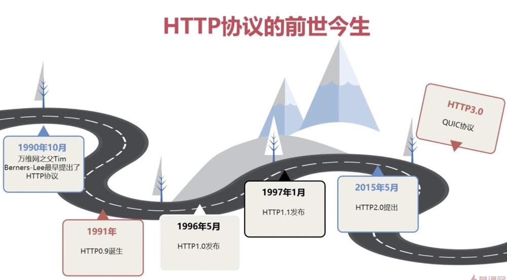
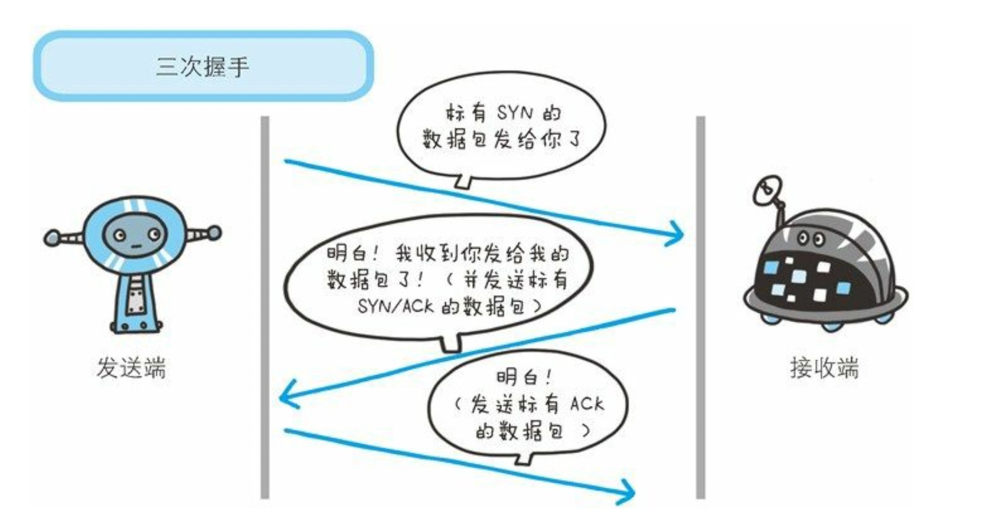
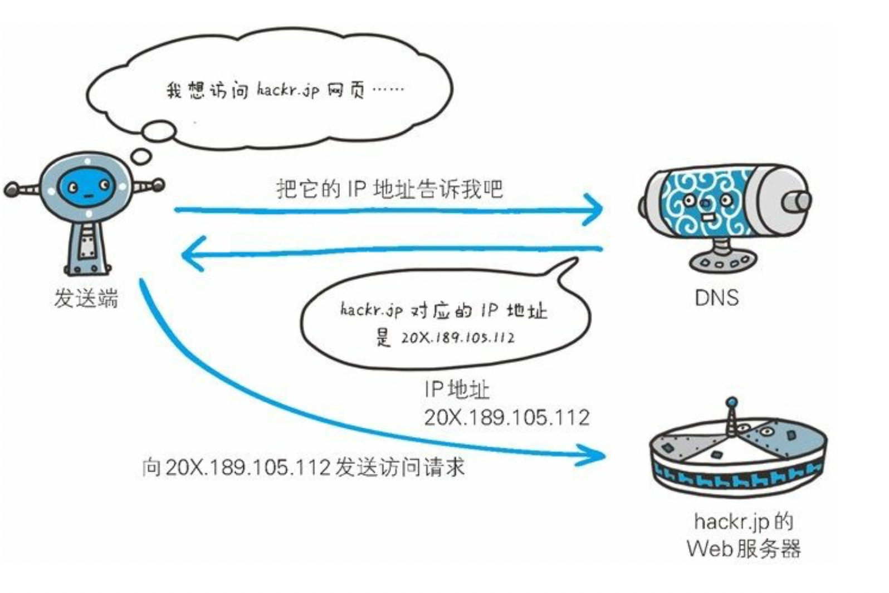
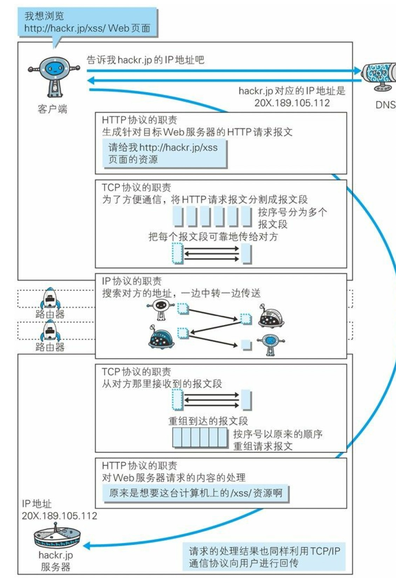
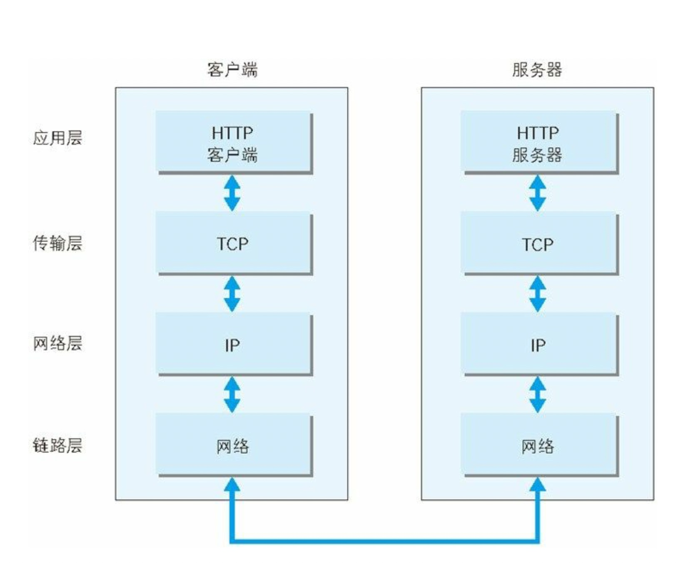
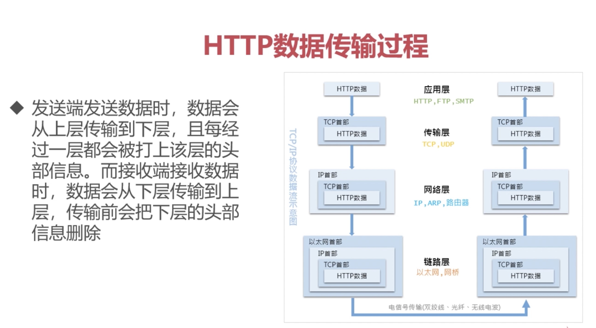

## 初相识 —— 了解HTTP协议

### 浏览器背后的故事
- 相亲背景：[浏览器背后的故事](./img/浏览器输入域名.jpg)
- 相亲对象：HTTP 协议（大名：超文本传输协议，严格翻译：超文本转移协议）
- 超文本：带有超链接的文本，常见的就是 html，xml
- 请求访问文本或图像等资源的一端称为客户端，而提供资源响应的一端称为服务器端。
> ps:主要针对HTTP1.1版本
### HTTP协议的前世今生
- HTTP的前世今生：
- 父亲：万维网之父 TimBerners—Lee(蒂姆·贝纳斯·李)
- 家族：TCP/IP 协议族

### TCP/IP协议族与HTTP
- 族规：
- 三次握手的根本目的：客户端和服务端要进行连接，要确认双方通讯正常，为了准确无误地将数据送达目标处。
- 一次握手：客户端有发送能力
- 二次握手：服务端有接收能力和发送能力
- 三次握手：客户端有接收能力
- 若在握手过程中某个阶段莫名中断，TCP 协议会再次以相同的顺序发送相同的数据包。
- 除了上述三次握手，TCP 协议还有其他各种手段来保证通信的可靠 性。
> 族规的缺陷：需要每次都验证

### DNS域名解析
- HTTP的朋友：DNS
- DNS 服务是和 HTTP 协议一样位于应用层的协议。它提供域名到 IP 地址之间的解析服务。
- DNS 协议提供通过域名 查找 IP 地址，或逆向从 IP 地址反查域名的服务。
- DNS：一串 IP 地址 让人们难以记忆，所以有了域名（单词和数字的组合体，符合人的记忆），然后通过DNS解析出对应的ip地址
- 域名的解析必须有一个结果：IP 地址，或者不存在
- 就近解析原则：本机host文件 => 本地的DNS服务器 => 在往上，直到找到或者不存在

### 事务处理过程：完整的工作方式
- HTTP和DNS的合作过程：
- 1、客户端浏览器输入域名访问web服务器，
- 2、通过DNS查询到域名 IP 地址，
- 3、生成http请求，在TCP协议的帮助下，与ip对应的web服务器建立TCP连接，三次握手判断双方通讯正常，正常则传输http请求，
- 4、web服务器在接收到请求后，会根据请求生成响应的内容，也在TCP协议的帮助下，返回给客户端。
- 5、通讯完成，TCP连接释放

### 更细致的工作流程
- 1、浏览器浏览一个页面
- 2、从域名中分解出：协议名，主机名，端口，对象路径等等
- 3、通过DNS解析出域名的ip地址
- 4、封装http数据包，以上的域名信息等等
- 5、http数据包再封装成TCP包，需要通过TCP链接进行传输 
- 6、建立TCP链接：三次握手
- 7、发送请求给Web服务器
- 8、Web服务器作出响应，回复响应内容
- 9、释放TCP链接

### 扩充
- TCP/IP 协议族里重要的一点就是分层。TCP/IP 协议族按层次分别分为以下 4 层:应用层、传输层、网络层和数据链路层。
- 为什么分层：层次化的好处，

- 易于改动：如果互联网只由一个协议统筹，某个地方需要改变设计时，就必须把所有部分整体替换掉。而分层之后只需把变动的层替换掉即可。把各层之间的接口部分规划好之后，每个层次内部的设计就能够自由改动了。

- 各司其职：层次化之后，设计也变得相对简单了。处于应用层上的应用可以只考虑分派给自己的任务，而不需要弄清对方在地球上哪个地方、对方的传输路线是怎样的、是否能确保传输送达等问题。

- 应用层：应用层决定了向用户提供应用服务时通信的活动。
- TCP/IP 协议族内预存了各类通用的应用服务，比如，FTP(File Transfer Protocol，文件传输协议)和 DNS(Domain Name System，域 名系统)服务就是其中两类。

- 传输层：传输层对上层应用层，提供处于网络连接中的两台计算机之间的数据传输。
- 在传输层有两个性质不同的协议:TCP(Transmission Control Protocol，传输控制协议)和 UDP(User Data Protocol，用户数据报协议)。

- 网络层：网络层用来处理在网络上流动的数据包。
- 数据包是网络传输的最小数据单位。该层规定了通过怎样的路径(所谓的传输路线)到达对方计算机，并把数据包传送给对方。
- 网络层所起的作用就是在众多的选项内选择一条传输路线。

- 数据链路层：用来处理连接网络的硬件部分。包括控制操作系统、硬件的设备驱动、NIC(Network Interface Card，网络适配器，即网卡)，及光纤等物理可见部分(还包括连接器等一切传输媒介)。硬件上的范畴均在链路层的作用范围之内。

