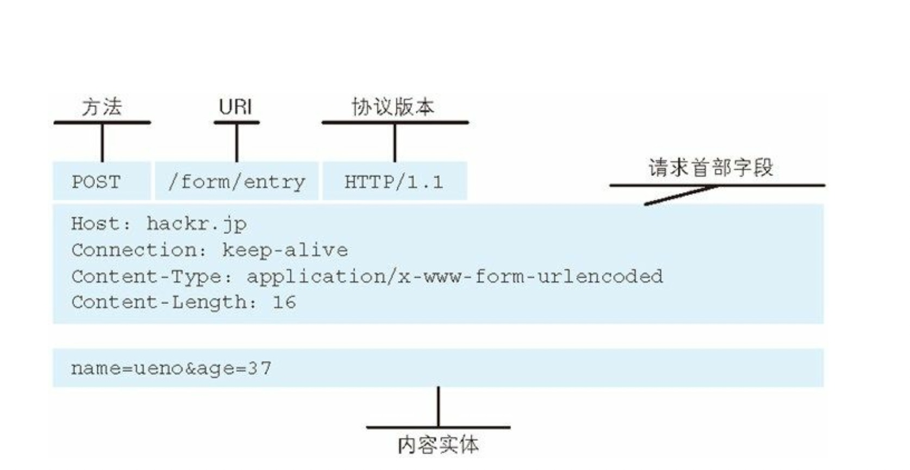
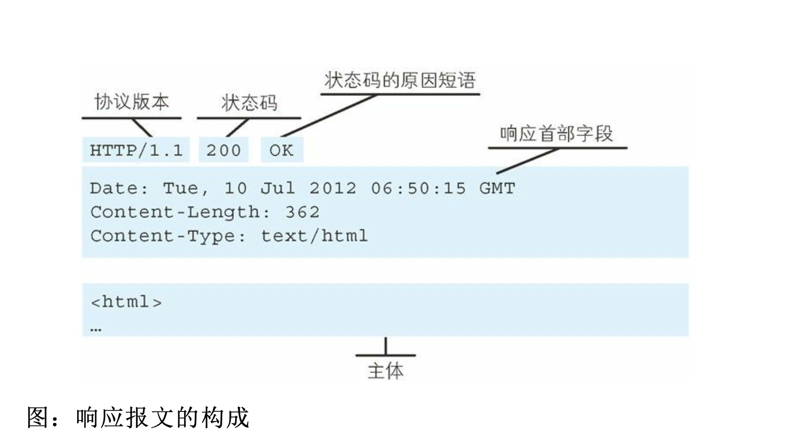
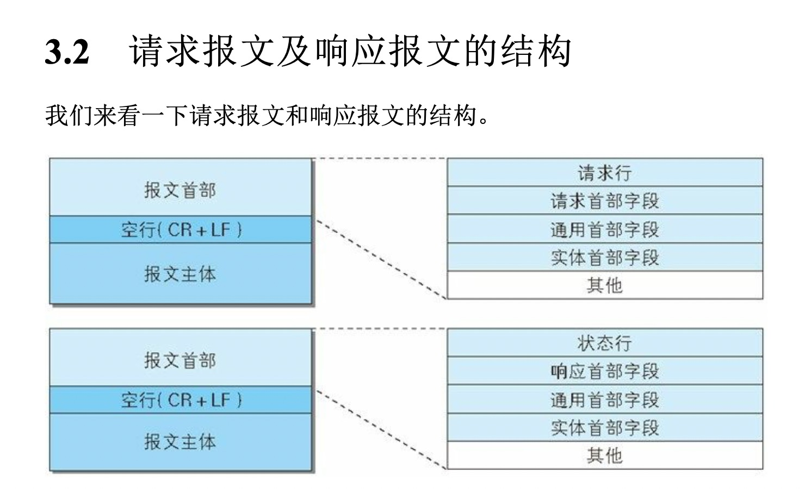
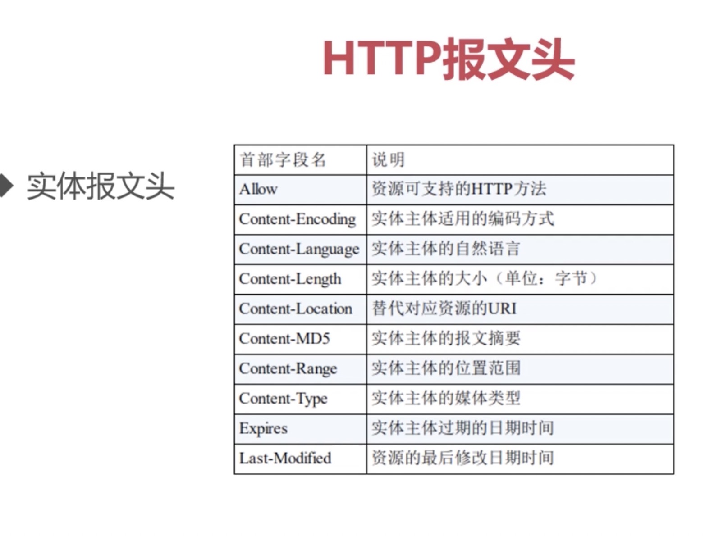
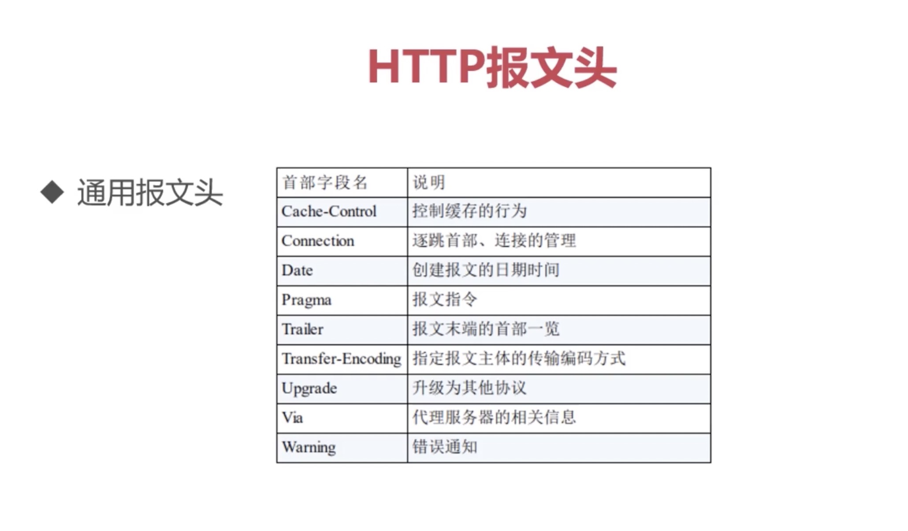
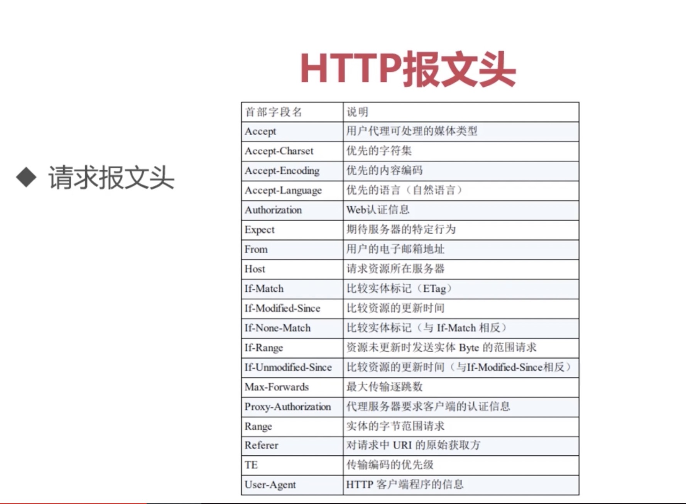
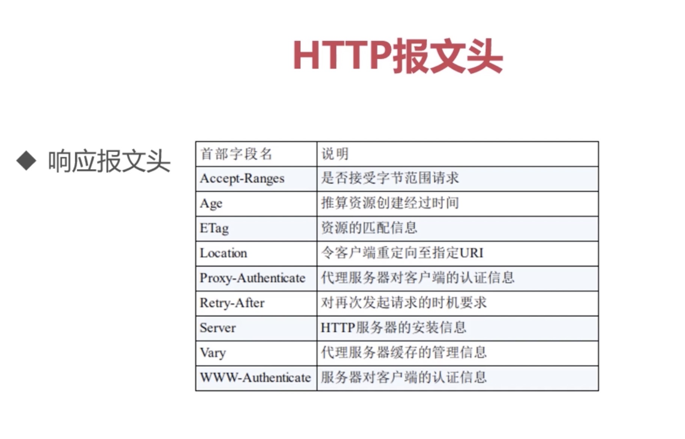
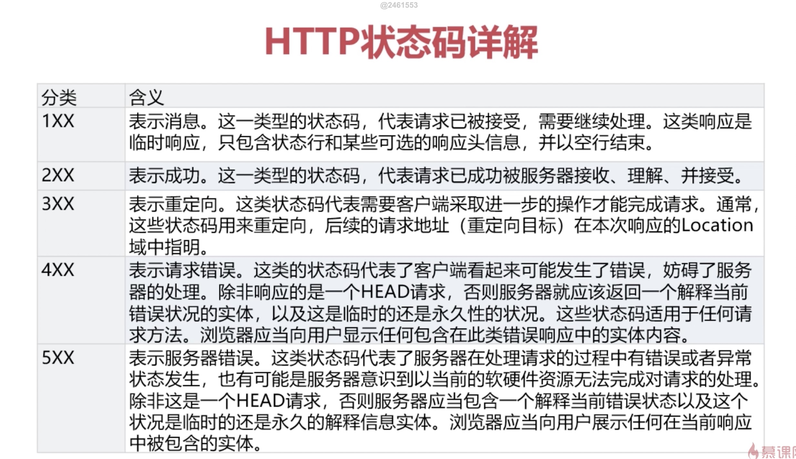

## 再邂逅 —— 协议的结构和通讯原理

### 协议特点（性格特征）：
- 支持客户/服务器模式：因为他是TCP协议家族的一份子，继承了先辈的优良传统
- 通过请求和响应的交换达成通信
- 简单快捷：只需要传输简单的方法和路径，程序规模小，使得通讯快捷。（单纯，任劳任怨，做事勤快）
- 灵活：允许传输任意类型对象（成长的产物：通过学习，增加了自己的技能）
- 无连接：限制每次连接只处理一个请求。服务器处理完客户端的请求，并收到客户端的应答后，即断开连接，节省传输时间（持家好能手）
>ps:随着网页越来越复杂，这样就会特别低效，所以就有了新技能：keep-alive(保持活性，后期的发展)，让服务器与客户端的连接（TCP连接）持续有效（长连接，短链接）
- 无状态：在不需要先前状态的情况下，它的应答很快，即无状态协议（比大爷的记性还差，需要cookie，session帮记录）

### URL和URI的区别与联系：迷之兄弟
- URI: 用于标识某一互联网资源名称的字符串。可以进一步被分为定位符，名字或者两者都是。
- URL 是 URI 的子集，除了确定一个资源，还提供一种定位该资源的主要访问机制（如其网络‘位置’，ftp，http）
- 深入理解：
- URI 可以分为 URL, URN 或同时具备 locators 和 names 特性的一个东西
- URN 作用就好像一个人的名字，URL 就像一个人的地址
- 换句话：URN 确定了东西的身份，URL 提供了找到它的方式

### HTTP报文结构分析：身材相貌
- 报文：是 HTTP 通信中的基本单位，通过 HTTP 通信传输。
- 实体：作为请求或响应的有效载荷数据(补充项)被传输，其内容由实体首部和实体主体组成。
> ps：通常，报文主体等于实体主体。只有当传输中进行编码操作时，实体主体的内容发生变化，才导致它和报文主体产生差异。

- 请求报文：是由请求方法、请求 URI、协议版本、可选的请求首部字段和内容实体构成的。

- 响应报文：基本上由协议版本、状态码、用以解释状态码的原因短语、可选的响应首部字段以及实体主体构成。

- 报文结构

- HTTP报文头：大体分成四类：通用报文头，请求报文头，响应报文头和实体报文头（文头 = 首部字段）

- 在HTTP1.1里一共规范了47种报文头字段

- 通用首部字段：请求报文和响应报文两方都会使用的首部。
- 请求首部字段：从客户端向服务器端发送请求报文时使用的首部。补充了请求的附加 内容、客户端信息、响应内容相关优先级等信息。
- 响应首部字段：从服务器端向客户端返回响应报文时使用的首部。补充了响应的附加
内容，也会要求客户端附加额外的内容信息。
- 实体首部字段：针对请求报文和响应报文的实体部分使用的首部。补充了资源内容更 新时间等与实体有关的信息。
 实体头域定义了关于实体主体的维护信息，或者是关于请求标识的资源，如果没有主体的话.一些维护信息是可选的，一些是必须的.

### 常见报文头

- Accept：浏览器可以接受的媒体类型
- Accept:text/html 代表浏览器可以接受服务器回发的类型为 text/html 也就是我们常说的 html 文档，如果服务器无法返回 text/html 类型的数据，服务器应该返回一个406错误（Non Acceptable）
- Accept: */* 代表浏览器可以处理所有类型（浏览器不忌口。。。）
- 如果想要给显示的媒体类型增加优先级，则使用q= 来额外表示权重值，
- 权重值 q 的范围 0～1（可精确到小数点后三位），且最大值为1。
- 当不指定权重值，则 q 默认为 1.0，
- 当服务器提供多种内容时，将会优先返回权重值最高的媒体类型

- Accept-Encoding: gzip，deflate
- 作用：浏览器申明自己接收的编码方法，通常指定压缩方法，是否支持压缩，支持什么压缩方法（gzip，deflate）

- Accept-Language：zh-cn,zh;q=0.7,en-us,en;q=0.3
- 作用：浏览器申明自己接收当语言
- 客户端在服务器有中文版资源当情况下，会请求其返回中文版对应的响应，没有中文版时，则请求返回英文版响应如果都没有则会返回406

- Connection: keep-alive
- 当一个网页打开完成后，客户端和服务器之间用于传输都 HTTP 数据的 TCP 链接不会关闭，如果客户端再次访问这个服务器上的网页，会继续使用这一条已经建立的链接

- Connection: close 代表一个 Request 完成后，客户端和服务器之间用于传输 HTTP 数据的 TCP 链接会关闭，当客户端再次发送 Request，需要重新建立 TCP 链接

- Host:
- 作用：请求报文头域主要用于指定被请求资源的 Internet 主机和端口号，它通常从 HTTP URL 中提取出来

- 我们在浏览器中输入： http://www.baidu.com:8080
- 浏览器发送的请求中，就会包含Host请求报头域，Host：www.baidu.com:8080

- Referer: https://cn.bing.com/ 当浏览器向web服务器发送请求的时候，一般会带上 Referer，
- 作用：告诉服务器我是从哪个页面链接过来的，服务器借此可以获得一些信息用于处理。

- User-Agent:Mozilla/5.0 (Macintosh; Intel Mac OS X 10_15_2) AppleWebKit/537.36 (KHTML, like Gecko) Chrome/86.0.4240.75 Safari/537.36
- 作用：告诉HTTP服务器，客户端使用的操作系统和浏览器的名称和版本
- 很多情况下我们会通过 User-Agent 来判断浏览器类型，从而进行不同的兼容设计

- Content-Type: text/html;charset=utf-8
- 作用：说明了报文体内对象的媒体类型
- text/html：HTML格式  
- text/plain: 纯文本格式
- text/xml: xml格式
- image/gif: gif图片格式
- image/jpeg: jpg图片格式
- image/png: png图片格式
- application/xhtml+xml: XHTML格式
- application/xml: XML格式
- application/atom+xml: Atom XMl 聚合格式
- application/json: JSON格式
- application/pdf: pdf格式
- application/msword: Word格式
- application/octet-stream: 二进制数据（常见的文件下载）
- application/x-www-form-urlencoded : 表单提交 
- multipart/form-data
- 等等

- 我们最终是要获取响应报文的响应体 

### HTTP请求方法（谈吐举止：会说的语言）
- HTTP会的语言: 
- GET：用来请求访问已经被URI识别的资源，指定资源服务器端解析后返回的响应内容。
- get方法也可以用来提交表单和其他数据
> ps：缺点：url有长度限制，安全性不高，

- POST方法与GET功能类似，一般用来传输实体的主体，POST 方法的主要目的并不是获取响应的主体内容。
- ps：最初只有 get ，后来需要提交大量的表单数据，就有了post（还有get信息无法保密问题）

- PUT: 从客户端传送的数据取代指定的文档内容。
- 作用：用作资源传输（安全性不高，不常用）

- HEAD:方法类似于 GET 请求，只不过返回的响应中没有具体的内容，用于获取报头

- DELETE: 请求服务器删除指定资源（安全性有问题，容易被非法删除）

- TRACE: 回显服务器收到的请求，主要用于测试或诊断 （容易引发XST攻击（跨站追踪））

- CONNECT：开启一个客户端与所请求资源之间的双向沟通的通道，它可以用来创建隧道。不常用（常用http代理，）

### 响应状态码分析（聆听他人，反馈信息：心理医生）
- 状态码：是用以表示网页服务器超文本传输协议响应状态的三位数字代码

- 常用状态码：
- 200 OK 请求成功，请求希望返回的响应头或者数据体将随着返回。
- 202 Accepted  已接受，已接受请求，但是未完成处理
- 206 Partial Content 部分内容，服务器成功处理了部分GET请求
- 理解：请吃饭，同意了，在吃了（200）。以后在吃（202）。同意了，吃到一半，下次继续（206，断点续传）

- 301 Moved Permanently 永久重定向，请求的资源已经被转移到了新的URI，返回信息包括新的URI，浏览器会自动跳到新的URI
- 302 Found 临时重定向，资源被临时移动，客户端继续使用原来的URI
- 理解：搬家留下地址（301），出去旅游，留下临时的酒店地址（302）

- 400 Bad Request 客户端请求的语法错误，服务器无法理解
- 401 Unauthorized 请求要求用户认证身份
- 403 Forbidden 服务器理解请求客户端的请求，但是拒绝执行次请求
- 404 Not Found 服务器无法根据客户端的请求查找到资源（网页）
- 理解：鸡同鸭讲（400），钥匙开错门，进不去（403），喝多了把窗户错认门（404）

- 500 Internal Server Error 服务器内部错误，无法完成请求
- 502 Bad Gateway 充当网关或者代理的服务器，从远端服务器接收到一个无效的请求
- 理解：开门钥匙断了（500）

### Cookie 与 Session
- HTTP的缺点：无状态
- 无状态的优点：效率快
- 无状态的缺点：没有状态信息
- HTTP状态管理，Cookie与session：借助外物帮自己记忆
- 会话跟踪技术
- 客户端的状态存储：cookie
- 服务端的状态存储：session
- 存储 sessionID的方式：cookie，url重写，隐藏表单
- cookie，session 的不同点：存放位子不同，安全性不同。有效期不同，对服务器造成的压力不同
- 存放位子:客户端，服务端
- 安全性：客户端的安全性比不上服务端，服务器隐私保护好
- 有效期：cookie可以长久存储，session会被服务器定期清除，
- 服务器造成的压力：当高并发状态下，session会对服务端有压力。