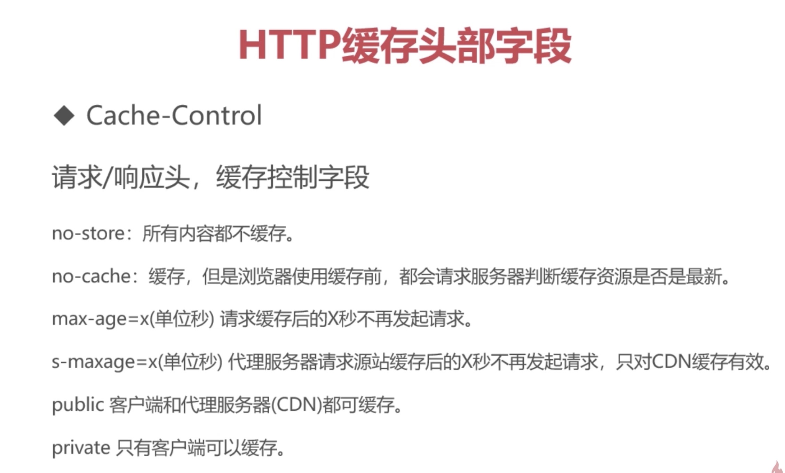
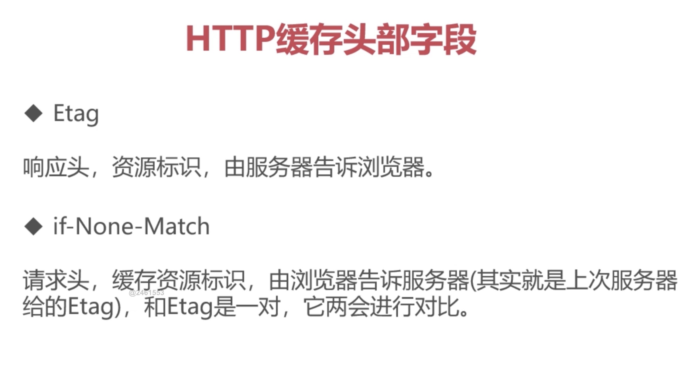
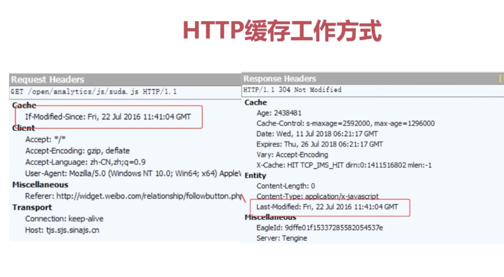
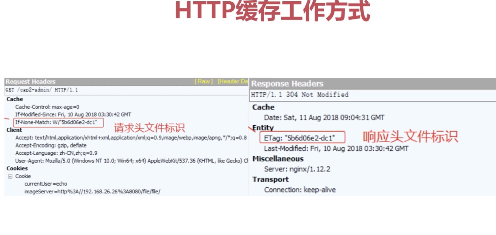
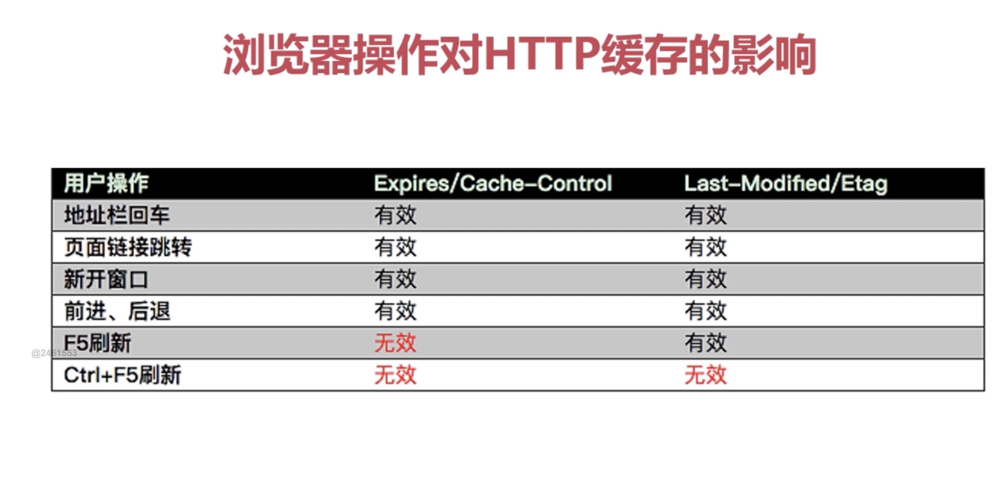
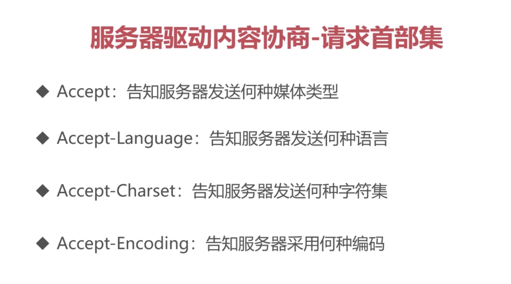

## 渐相知 —— HTTP的特性

### HTTP的编码和解码（把自己听不懂的语言转化成自己能懂的）
- 什么是码：字符集
- 什么是编码：一个较短的二进制数，通过一种编码方式（utf-8等等），转化成字符集中对应的地址，然后字库表中找到一个对应的字符，展示给用户
- 常见的编码规范：ASCll码，GBK，ISO-8859-1(不支持中文)，Unicode(世界通用编码规范，utf-8，utf-16，utf-32...)
- 网页上的乱码，到底怎么来的：
- 1、字符库没有这个字符。
- 2、编码，解码的方式不一致。
- 什么是解码：参照对应编码方式，进行对应的解码，解码成计算机能识别的二进制数
- URL的编码与解码：'%'编码，URL是ASCll码，浏览器仅会对非ASCll码编码

### HTTP协议之基本认证（来者何人）
- 认证：安全性，效率
- 认证方式：
- BASIC认证：基本认证，从http1.0定义的认证方式，不够便捷灵活，安全度不高。
- DIGEST认证：在BASIC认证上做了补充，MD5算法提高了验证的安全等级（相对于https其他还是很弱），但也不够便捷灵活。
- SSL客户端验证：是借助于HTTPS客户端证书来完成验证的方式。凭借客户端证书，判断是否来自自己登录的客户端。不好操作。
- 基于表单的验证：基于表单验证方法并不是在HTTP协议中定义，使用由Web应用程序各自实现基于表单的认证方式，通过Cookie和Session的方式保持用户状态(常用)

### HTTP长链接和短链接(全职和兼职)
- 长链接和短链指的是 TCP 这个通道建立的时间长短
- 短链接：一锤子买卖，http请求结束，同时关闭TCP通道
- 长链接：长久往来，给定通道开启时间，在这通道下，可多次发送http请求

### HTTP中介之代理
- 代理的作用：抓包，FQ，匿名访问，过滤器
- 代理相同协议

### HTTP中介之网关
- 协议转换

### HTTP缓存
- 为什么要有缓存：客户端页面加快，服务端占用减少
- 缓存内容：静态文件 （css，js，html。图片资源等）
- 实现方式：请求头和响应头配置
- ps：http版本越高。所对应的配置权限越高
- 文件没修改过：返回 304 重定向到缓存
- 缓存控制字段 (响应头/请求头)：cache-control: max-age=86400  最高指令，是否需要缓存（请求缓存后的 86400s 不再发起请求）
- HTTP缓存头部字段：
- Expires 响应头:  代表资源过期时间，由服务器返回，与 max-age共存的情况下，优先级较低 http1.0

- HTTP缓存头部字段1：
- Last-Modified 响应头：资源最新修改时间，服务器提供
- if-Modified-Since 请求头：资源最新修改时间，由浏览器告诉服务器。和 Last-Modified 是一对，会相互比较。 http1.1

- HTTP缓存头部字段2：
- Etag 响应头：资源标识，服务器告诉浏览器
- if-None-Match 请求头：缓存资源标识（响应头的Etag），浏览器告诉服务器，和 Etag 进行对比

> CDN：浏览器与服务器的临时站点（服务器的小弟，也能缓存），分流，访问加速

场景模拟：
- 场景：服务器给浏览器了一个 Expires 响应头，Expires过期了。请求服务器。获取资源
- 不足，Expires过期了，但是 f.js 没有修改，需要避免这种资源浪费的情况
- 优化：Last-Modified 和 if-Modified-Since 一组资源修改时间标识，
- 服务器给浏览器了响应头 Expires 的同时给了 Last-Modified， Expires过期了，请求资源，服务器会对比 Last-Modified 和 if-Modified-Since，判断 f.js 是否修改，

- 不足，由于 Last-Modified 和 if-Modified-Since 时间只能精确到秒，在一些极端情况下，获取不到最新资源
- 优化：增加文件内容对比标记：Etag 和 if-None-Match，Expires 不稳定 ，再加入一个 max-age 代替
- 在之前的基础上新增了 文件内容标识， 这样就可以判断资源内容有没有变了

- 上诉方案都存在一个问题：都是被动的去判断资源是否修改，做不到主动判断。
- 修改文件路径
- 改进方案：md5/hash 缓存 通过不缓存 html ，为静态文件添加md5或者hash标识，解决浏览器无法跳过缓存过期时间，主动去感知文件变化问题。
> CDN也能解决缓存问题
- 前端缓存：

### 内容协商方式
- ps: 国际化用到很多，不同国家对应不同语言的网站
- 请求头 req
- Accept：告诉服务器自己能接受的媒体类型
- Accept-Language: 能接受的语言 (用的最多)
- Accept-Charset: 能接受的字符集(unicode)
- Accept-Encoding: 能接受的编码方式(utf-8)
- 响应头 res
- Content-Type
- Content-Language
- Content-Encoding

- 三种方式：
- 客户端驱动：客户端发起请求，服务端发送可选项列表，客户端选择后在发送第二次请求。
- 服务端驱动：服务器检查客户端的请求头部集，决定提供哪些版本的页面。 

- 透明协商：缓存代理，某个中间设备。替代客户端进行协商

### 断点续传和多线程下载
- 如何实现：HTTP是通过在Header里两个参数实现。
- 请求头Range：指定第一个字节的位置和最后一个字节的位置，格式：Range:bytes=0-499(表示0到499字节内，左开右闭)
- 响应头Content-Range：返回当前接受的范围和总文件大小。格式：Content-Range:bytes 499-/1024000 (总大小1024000，已经下载499)
- 响应完成后：响应头不同 HTTP/1.1 200 OK(不使用断点) HTTP/1.2 206 Partial Content (使用断点)

- 场景模拟：
- 1.客户端下载一个 1024K 文件，已下载 500k
- 2.网络中断，客户端请求续传，请求头部信息添加 Range:bytes=500000- ,通过这个头通知服务器从文件 500k位子开始传输
- 3.服务器接收到断点续传请求，从文件的500k位子开始传输，并在响应头添加 Content-Range:bytes 500000-/1024000,并且此时服务端返回的HTTP状态码为206，不为200