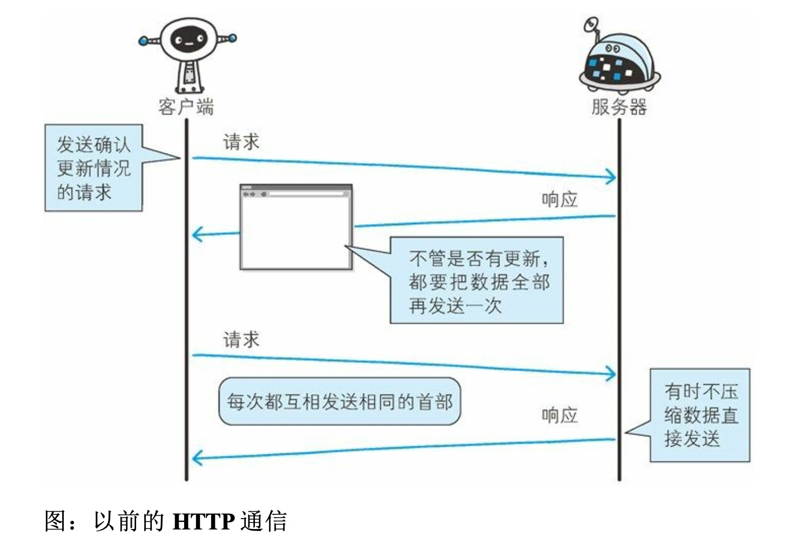
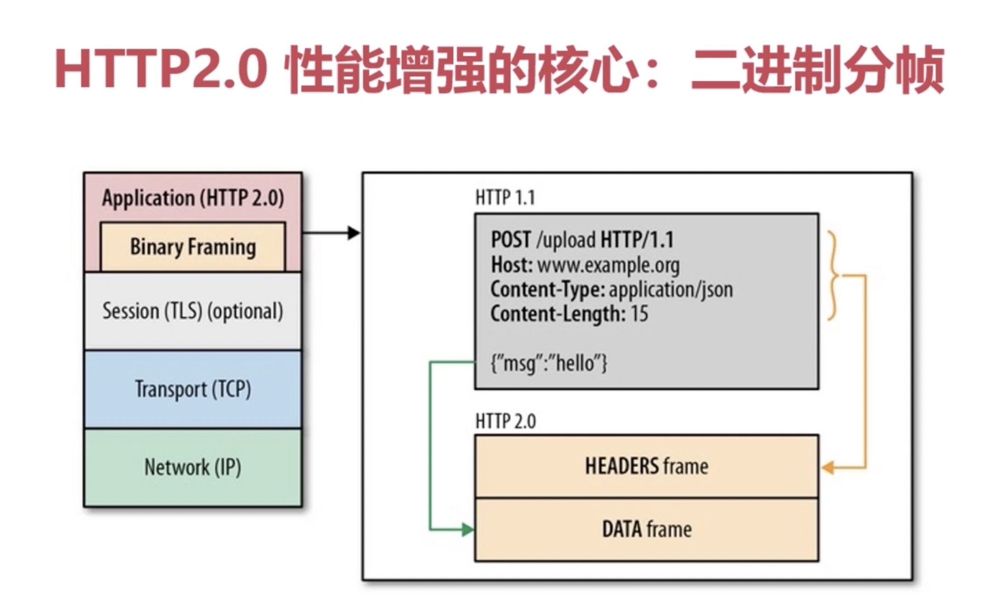
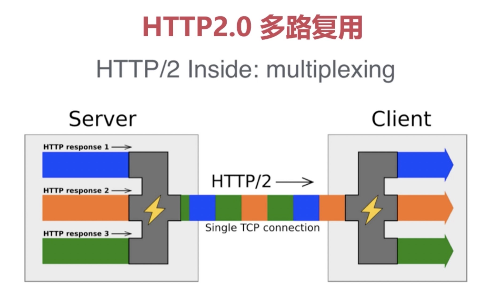
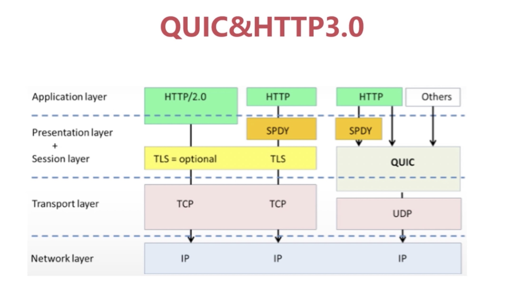

## 长相随 —— 基于HTTP的功能追加协议

- 影响HTTP请求的因素：带宽，延迟
### 协议瓶颈：
- 一条连接上只可发送一个请求。
- 请求只能从客户端开始。客户端不可以接收除响应以外的指令。
- 请求 / 响应首部未经压缩就发送。首部信息越多延迟越大。
- 发送冗长的首部。每次互相发送相同的首部造成的浪费较多。
- 可任意选择数据压缩格式。非强制压缩发送。

### 双向通信的WebSocket
- WebSocket与HTTP：有交集但不是全部
- 特点：
- 持久化协议
- 被动变为主动：主动推送数据
- 减少通信量（头部信息）
- 实时性优势

### 探索式的实践-SPDY：谷歌提出
- 优点：
- 多路复用，赋予请求优先级。
- 支持服务器推送技术。
- SPDY压缩了HTTP头。
- 强制使用了SSL传输协议。

### HTTP2.0 - 2015年
> SPDY升级版
- 新特点：
- 性能增强核心：二进制分帧技术

- 首部压缩：首部表跟踪和存储，只有新增和修改的首部信息会被发送。
- 多路复用：把请求分成一个个帧

- 单链接多资源的优势：减少服务链接压力，改善网络拥塞状况，拥塞和丢包恢复更快
- 请求优先级：高优先级的流优先发送，优先级不是绝对的，不同优先级混合也是必须的

### 大跃进： QUIC 与 HTTP3.0

- 抛弃TCP
- HTTP2.0的问题：
- 队头阻塞：多路复用情况下，丢包。整个TCP都要等待重传（性能不如HTTP.1）
- 建立链接握手延迟大：
- QUIC特性：
- 0 RTT 
- 没有队头阻塞的多路复用