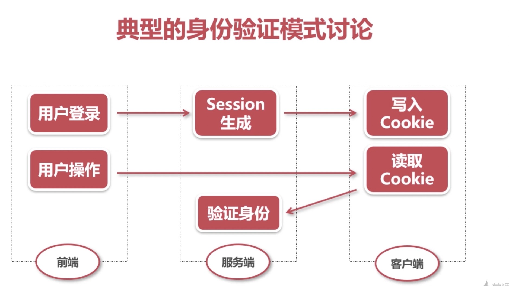
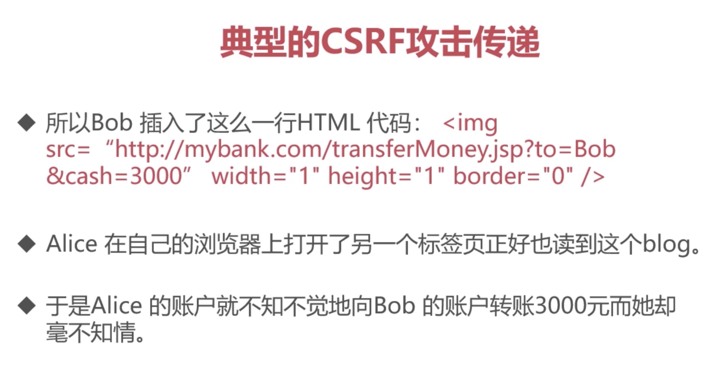

## HTTP终相守 —— Web安全威胁解析

### Web安全攻击概述
- 简单的 HTTP 协议本身并不存在安全性问题，因此协议本身几乎不会成为攻击的对象。应用 HTTP 协议的服务器和客户端，以及运行在服务器上的 Web 应用等资源才是攻击目标。
- 对 Web 应用的攻击模式有以下两种。 主动攻击，被动攻击
- Web应用的概念：
- 安全问题大多出现在Web层：发起HTTP请求
- 为啥登录时候需要验证码：防止暴力破解
- 网站长时间没有操作：避免用户信息泄漏，session 失效（服务器直接失效）
- 解决安全问题的手段：扩容，限流，提高访问限制

### 验证机制安全
- 最简单的一层安全机制：登录，注销
- 防止暴力破解：验证码技术，
- 多阶登录机制：
### 会话管理机制
- 持续保证特定用户的身份真实性。
- 恶意攻击的主要目标：破坏了会话机制，可以轻易避开验证机制
- 生成会话令牌的隐患：令牌安全度不高
- 会话传输时的隐患：会话终止攻击
- 会话劫持攻击：XSS攻击（跨站脚本攻击），目前最多的攻击方式

### SQL注入攻击
- 原理：用户提交一段数据库查询代码，根据返回结果获取他想得知的数据
- 可以修改数据库的数据
- SQL注入的危害：
- 探知数据库数据结构，为进一步攻击做准备
- 数据泄漏
- 获取更高权限
### 跨站脚本攻击：XSS
- 恶意在网站注入html或者js发动攻击：钓鱼网站
- 攻击成功获取私密内容和用户令牌
- 危害：盗取各类账号，串改数据，非法转账，把用户电脑变成肉鸡等等
- 防御：严格的输出和输入确认
### CSRF攻击
- CSRF：跨站请求伪造 - 沉睡的巨人
- 破坏力依赖于受害者的权限
- 普通用户：危害用户数据，和一些功能
- 管理员权限：危害整个网站的安全
- 例子：
- 预防CSRF攻击：增加确认操作，敏感操作的时候重新认证（安全性和易用性的取舍）。使用token

### 总结：
协议版本	 解决的核心问题	             解决方式
0.9	      HTML 文件传输	            确立了客户端请求、服务端响应的通信流程
1.0	      不同类型文件传输	          设立头部字段
1.1	      创建/断开 TCP 连接开销大	  建立长连接进行复用
2	        并发数有限	               二进制分帧
3	        TCP 丢包阻塞	            采用 UDP 协议