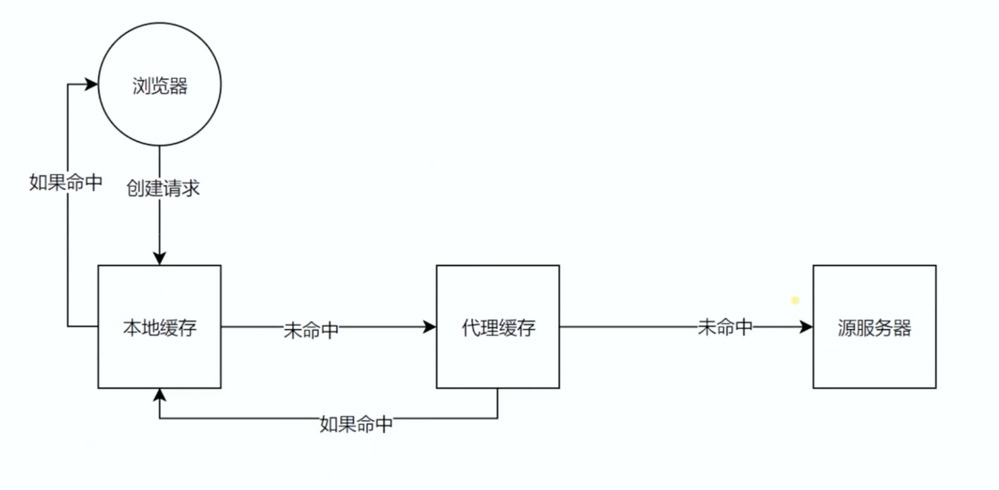

http简单例子：
1、输入 url打开网页
2、ajax获取数据
3、img加载图片资源

浏览器输入url后http请求返回的完整过程

1、记录了请求地址被重定向（访问重定向地址）
2、请求的资源是否缓存
3、域名对应的地址
4、tcp连接，三次握手（或者安全连接 https）
5、发送请求
6、响应请求

五层网络模型：下三层属于硬件方面的配置。我们主要研究应用层，应用层基于网络层
应用层：为应用软件提供服务 http，https
传输层：为用户提供可靠的端到端服务 TCP/IP协议
网络层：为数据传输节点之间创建逻辑链路
链路层：在通信的实体间建立数据链路连接
物理层：定义物理设备如何传输数据

HTTP协议发展史：
HTTP 0.9
最开始只有一个命令 GET 
没有 HEARD 等信息描述
服务器发送完毕，就会关闭 TCP 连接

HTTP 1.0
增加了很多命令
增加了status code 和 header
多字符集支持，多部分发送，权限，缓存等

HTTP1.1
持久连接
pipeline (发送多个请求)
增加了一些host和其他等一些命令（跑多个服务，通过host判断）

HTTP2
所用数据都是以二进制传输
同一个连接里发送多个请求不再需要按顺序来
头信息压缩以及推送等一些提高效率的功能

HTTP 三次握手

为什么有：网络传输存在延时性
http只有请求和响应，他们通过TCP来连接 客户端 和 服务器

URI URL URN

URI: 统一资源标志符（包含URL URN）
URL: 统一资源定位器
URN: 永久统一资源定位符

HTTP 报文

HTTP 方法
用来定义资源的操作
常用 GET，POST 等
从定义上讲，有各自的语义

HTTP code
定义服务器处理请求的结果
各个区间的 code 有各自的语义
100-199 表示请求持续进行
200-299 表示请求成功 200 
300-399 表示请求重定向 301
400-499 表示发送请求错误 401
500-599 表示请求服务器出错 500

终端输入 curl -v www.baidu.com  能看到报文信息

关于跨域：对响应请求端，需要配置 Access-Control-Allow-Origin 头才能跨域获取资源
关于跨域配置：参考文件
[server](./server.js) 模拟客户端
[server2](./server2.js) 模拟跨域访问对资源服务器

关于客户端跨域：
浏览器允许标签路径加载资源对时候是允许跨域的
[关于客户端，跨域使用jsonp 实现跨域请求](./test.html)

CORS跨域限制以及预请求验证
CORS 预请求
methods，Content-Type，Headers 一部分是默认跨域跨域，有一些需要服务端配置跨域。需要预请求去处理
跨域默认允许方法methods：
GET，HEAD，POST

允许的Content-Type
text/plain
multipart/form-data
application/x-www-form-urlencoded

Cache-Control 的含义和使用 （只是限制性的作用，没有强制的约束力）
客户端缓存
可缓存性：
public：任何地方都允许缓存
private：请求的网页允许缓存
no-cache：允许本地缓存，需要发起服务器端的验证
到期：
max-age=<seconds> 缓存到期时间

重新验证：
must-revalidate 
proxy-revalidate
其他：
no-store: 不允许缓存
no-transform: 不允许资源转换

Cache-Control : max-age 配置
如果浏览器请求的 url 没有改变，且缓存配置的时间没有到期，他不会去请求新资源（不经过服务端的验证）
目前处理方式，url跟上hash值。表示这次的更新，去请求新资源

缓存验证 Last-Modified 和 Etag 的使用
资源验证：

Last-Modified：上次修改时间
配合 If-Modified-Since 或者 If-Unmodified-Since 头使用
对比上次修改时间来验证资源是否需要更新

Etag
数据签名
配合If-Match 或者 If-None-Match 头使用
对比资源的签名判断是否缓存

Cookie 和 session

Cookie
通过 Set-Cookie 设置
下次请求会自动带上
属性：
max-age expires 设置过期时间
Secure 只在 https 的时候发送
httpOnly无法js访问cookie
session 不等于 cookie
网站用到最多的是 cookie 来保存 session

HTTP 长连接
http1.1请求是有时间顺序的
http请求是在TCP连接上发送的
tcp最多6个并发请求。
一个TCP可以发送多个http请求
问题：浏览器允许的并发请求数量能不能调整
Connection: 'keep-alive' 保持连接，还可以设施长连接保持的时间
Connection:'close' 一个TCP只能一个http请求
http2.0 
信道复用
一个TCP可以并发http请求

数据协商：服务端和客户端相互约定数据传输的类型和方式
请求
Accept: 申明需要的数据类型 
Accept-Encoding: 用什么数据压缩方式
Accept-language: 返回的语言类型
User-Agent: 浏览器的内核版本（很混乱的一个属性） 判断端（pc or 移动）
返回
Content-Type:返回的数据类型（text/html:主类型/分支类型）
Content-Encoding: 用什么数据压缩方式
Content-language:返回的语言类型

代理缓存：

https：
公钥：
私钥：只放在服务器上