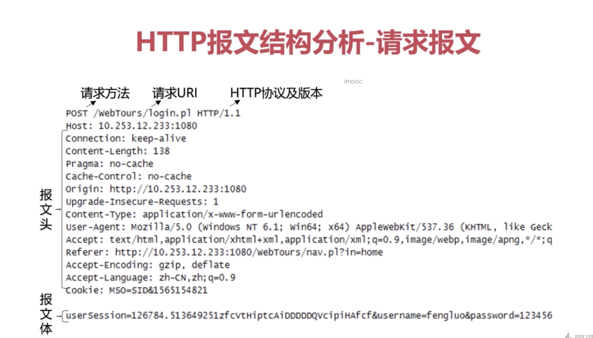

# HTTP协议的结构和通讯原理

### 协议特点（性格特征）：
- 支持客户/服务器模式：因为他是TCP协议家族的一份子，继承了先辈的优良传统
- 简单快捷：只需要传输简单的方法和路径，程序规模小，使得通讯快捷。（单纯，任劳任怨，做事快速）
- 灵活：允许传输任意类型对象（成长的产物：通过学习，增加了自己的技能）
- 无连接：限制每次连接只处理一个请求。服务器处理完客户的请求，并收到客户的应答后，即断开连接，节省传输时间（持家好能手）
>但是这样就会特别低效，所以就有了新技能：keep-alive(保持活性，后期的发展)，让服务器与客户端的连接（TCP连接）持续有效（长连接，短链接）
- 无状态：在不需要先前信息的情况下，它的应答很快，无状态协议（比大爷的记性还差，需要cookie，session帮记录）

### URL和URI的区别与联系：迷之兄弟
URI: 一个紧凑的字符串用来标示抽象或物理资源
A URI 可以进一步被分为定位符，名字或者两者都是
URL 是 URI 的子集，除了确定一个资源，还提供一种定位该资源的主要访问机制（如其网络‘位置’）
深入理解：
URI 可以分为 URL, URN 或同时具备 locators 和 names 特性的一个东西
URN 作用就好像一个人的名字，URL 就像一个人的地址
换句话：URN 确定了东西的身份，URL 提供了找到它的方式
结论：
URL 是 URI 的一种，但不是所有的 URI 都是 URL，
URI 和 URL 最大的差别是'访问机制'，
URN 是唯一标识的一部分，是身份信息

### HTTP报文结构分析：身材相貌

