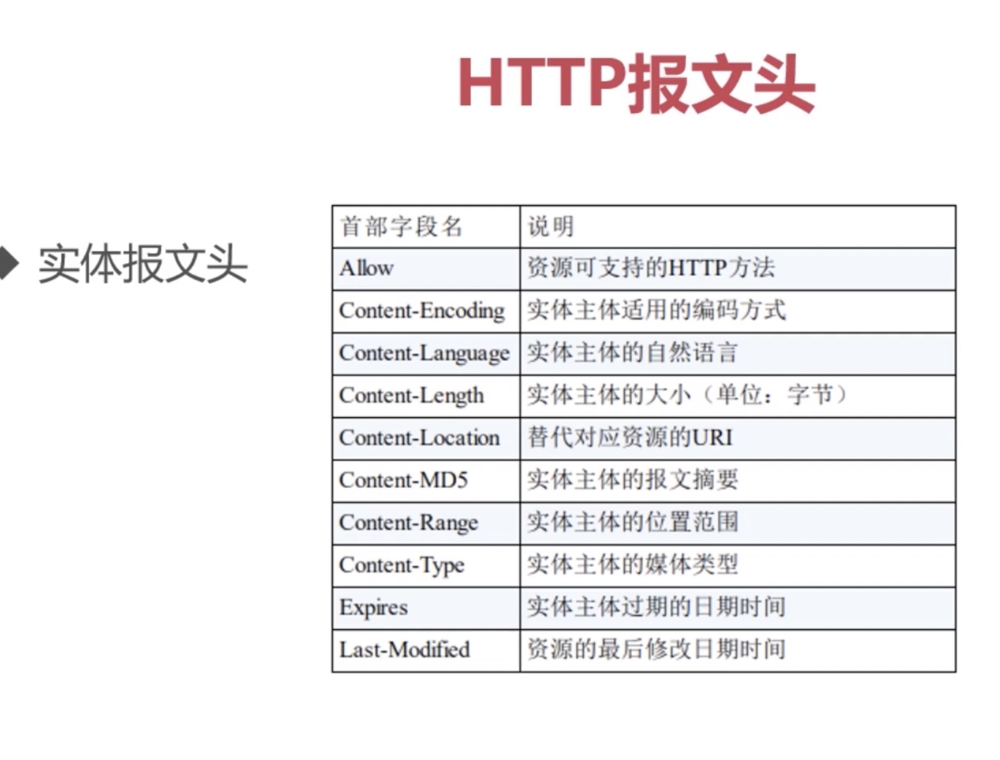
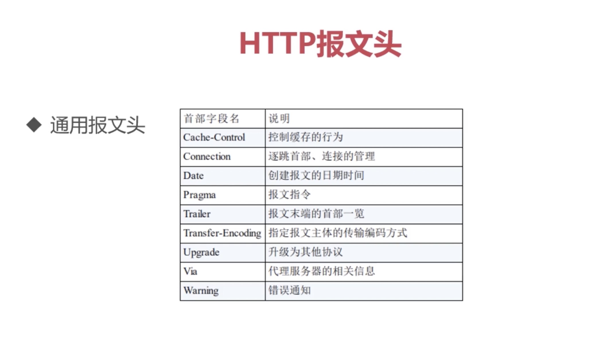
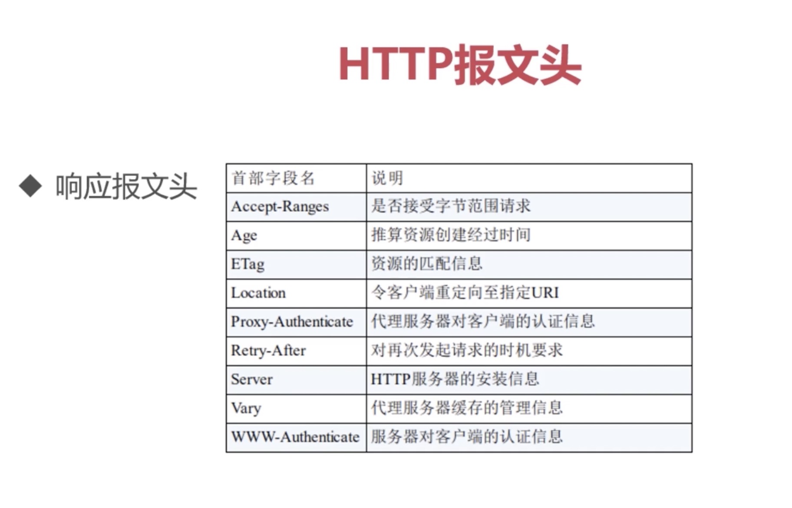
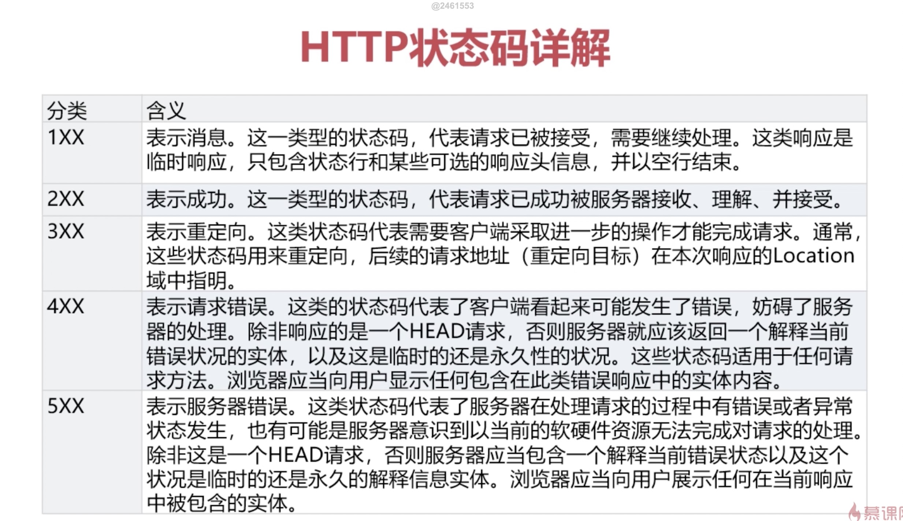
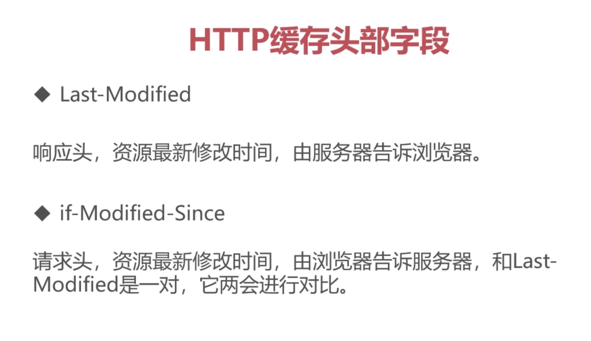
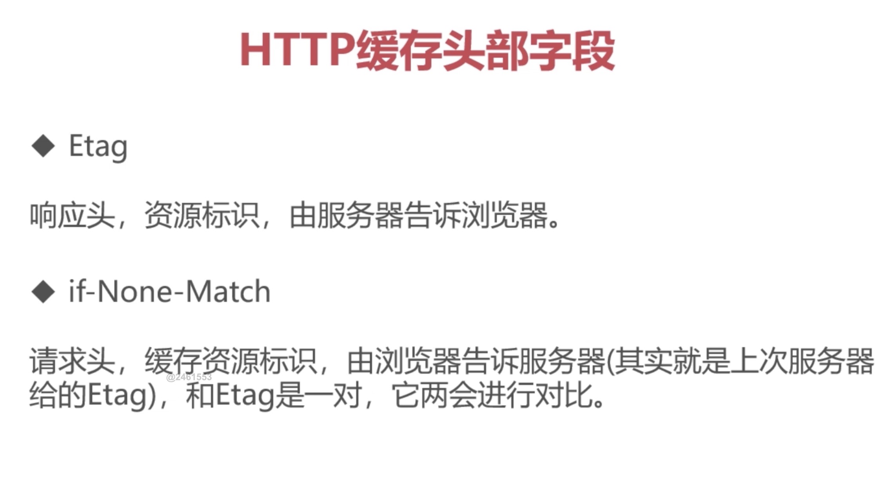

# HTTP协议的结构和通讯原理

### 协议特点（性格特征）：
- 支持客户/服务器模式：因为他是TCP协议家族的一份子，继承了先辈的优良传统
- 简单快捷：只需要传输简单的方法和路径，程序规模小，使得通讯快捷。（单纯，任劳任怨，做事勤快）
- 灵活：允许传输任意类型对象（成长的产物：通过学习，增加了自己的技能）
- 无连接：限制每次连接只处理一个请求。服务器处理完客户的请求，并收到客户的应答后，即断开连接，节省传输时间（持家好能手）
>ps:但是这样就会特别低效，所以就有了新技能：keep-alive(保持活性，后期的发展)，让服务器与客户端的连接（TCP连接）持续有效（长连接，短链接）
- 无状态：在不需要先前信息的情况下，它的应答很快，无状态协议（比大爷的记性还差，需要cookie，session帮记录）

### URL和URI的区别与联系：迷之兄弟
- URI: 一个紧凑的字符串用来标示抽象或物理资源。
- URI 可以进一步被分为定位符，名字或者两者都是
- URL 是 URI 的子集，除了确定一个资源，还提供一种定位该资源的主要访问机制（如其网络‘位置’）
- 深入理解：
- URI 可以分为 URL, URN 或同时具备 locators 和 names 特性的一个东西
- URN 作用就好像一个人的名字，URL 就像一个人的地址
- 换句话：URN 确定了东西的身份，URL 提供了找到它的方式
- 结论：
- URL 是 URI 的一种，但不是所有的 URI 都是 URL，
- URI 和 URL 最大的差别是'访问机制'，
- URN 是唯一标识的一部分，是身份信息

### HTTP报文结构分析：身材相貌

- HTTP报文头：
- HTTP的报文头大体分成四类：通用报文头，请求报文头，响应报文头和实体报文头
- 在HTTP1.1里一共规范里47种报文头字段

- 浏览器可以接受的媒体类型：
- Accept:text/html 代表浏览器可以接受服务器回发的类型为 text/html 也就是我们常说的html文档，如果服务器无法返回text/html类型的数据，服务器应该返回一个406错误（Non Acceptable）

- Accept: */* 代表浏览器可以处理所有类型（浏览器不忌口。。。）
- 如果想要给显示的媒体类型增加优先级，则使用q= 来额外表示权重值，
- 权重值 q 的范围 0～1（可精确到小数点后三位），且最大值为1。
- 当不指定权重值，则 q 默认为 1.0，
- 当服务器提供多种内容时，将会收哦先返回权重值最高当媒体类型

- Accept-Encoding: gzip，deflate
- 作用：浏览器申明自己接收当编码方法，通常指定压缩方法，是否支持压缩，支持什么压缩方法（gzip，deflate）

- Accept-Language：zh-cn,zh;q=0.7,en-us,en;q=0.3
- 作用：浏览器申明自己接收当语言
- 客户端在服务器有中文版资源当情况下，会请求其返回中文版对应当响应，没有中文版时，则请求返回英文版响应如果都没有则会返回406

- Connection: keep-alive
- 当一个网页打开完成后，客户端和服务器之间用于传输都 HTTP 数据的 TCP 链接不会关闭，如果客户端再次访问这个服务器上的网页，会继续使用这一条已经建立的链接

- Connection: close 代表一个 Request 完成后，客户端和服务器之间用于传输 HTTP 数据的 TCP 链接会关闭，当客户端再次发送 Request，需要重新建立 TCP 链接

- Host:
- 作用：请求报文头域主要用于指定被请求资源的 Internet 主机和端口号，它通常从 HTTP URL 中提取出来

- 我们在浏览器中输入： http://www.baidu.com:8080
- 浏览器发送的请求中，就会包含Host请求报头域，Host：www.baidu.com:8080

- Referer: https://cn.bing.com/ 当浏览器向web服务器发送请求的时候，一般会带上 Referer，
- 作用：告诉服务器我是从哪个页面链接过来的，服务器借此可以获得一些信息用于处理。

- User-Agent:Mozilla/5.0 (Macintosh; Intel Mac OS X 10_15_2) AppleWebKit/537.36 (KHTML, like Gecko) Chrome/86.0.4240.75 Safari/537.36
- 作用：告诉HTTP服务器，客户端使用的操作系统和浏览器的名称和版本
- 很多情况下我们会通过 User-Agent 来判断浏览器类型，从而进行不同的兼容设计

- Content-Type: text/html;charset=utf-8
- 作用：说明了报文体内对象的媒体类型
- text/html：HTML格式  
- text/plain: 纯文本格式
- text/xml: xml格式
- image/gif: gif图片格式
- image/jpeg: jpg图片格式
- image/png: png图片格式

- application/xhtml+xml: XHTML格式
- application/xml: XML格式
- application/atom+xml: Atom XMl 聚合格式
- application/json: JSON格式
- application/pdf: pdf格式
- application/msword: Word格式
- application/octet-stream: 二进制数据（常见的文件下载）
- application/x-www-form-urlencoded : 表单提交 
- 等等

- 我们最终是要获取响应报文的响应体 

### HTTP请求方法分析（谈吐举止：会说的语言）
HTTP会的语言: 

- GET ：用来请求访问已经被URI识别的资源，指定资源服务器端解析后返回的响应内容。
get方法也可以用来提交表单和其他数据
- ps：缺点：url有长度限制，安全性不高，

- POST方法与GET功能类似，一般用来传输实体的主体，POST 方法的主要目的不是获取响应主体的内容
- ps：最初只有 get ，后来需要提交大量的表单数据，就有了post（还有get信息无法保密问题）

- PUT: 从客户端传送的数据取代指定的文档内容。
- 作用：用作资源传输（不常用）

- HEAD:方法
类似于 GET 请求，只不过返回的响应中没有具体的内容，用于获取报头

- DELETE: 请求服务器删除指定资源（安全性有问题，容易被非法删除）

- TRACE: 回显服务器收到的请求，主要用于测试或诊断 （容易引发XST攻击（跨站追踪））

- CONNECT：开启一个客户端与所请求资源之间的双向沟通的通道，它可以用来创建隧道。（常用http代理）

### 响应状态码分析（聆听他人，反馈信息：心理医生）
- 状态码：是用以表示网页服务器超文本传输协议响应状态的三位数字代码

- 常用状态码：
- 200 OK 请求成功，请求希望返回的响应头或者数据体将随着返回。
- 202 Accepted  已接受，已接受请求，但是未完成处理
- 206 Partial Content 部分内容，服务器成功处理了部分GET请求
- 理解：请吃饭，同意了，在吃了（200）。以后在吃（202）。同意了，吃到一半，下次继续（206，断点续传）

- 301 Moved Permanently 永久重定向，请求的资源已经被转移到了新的URI，返回信息包括新的URI，浏览器会自动跳到新的URI
- 302 Found 临时重定向，资源被临时移动，客户端继续使用原来的URI
- 理解：搬家留下地址（301），出去旅游，留下临时的酒店地址（302）

- 400 Bad Request 客户端请求的语法错误，服务器无法理解
- 401 Unauthorized 请求要求用户认证身份
- 403 Forbidden 服务器理解请求客户端的请求，但是拒绝执行次请求
- 404 Not Found 服务器无法根据客户端的请求查找到资源（网页）
- 理解：对服务器说了一堆不懂的话（400），开错门，进不去（403），喝多了把窗户错认门（404）

- 500 Internal Server Error 服务器内部错误，无法完成请求
- 502 Bad Gateway 充当网关或者代理的服务器，从远端服务器接收到一个无效的请求
- 理解：开门钥匙断了（500）

### HTTP的缺点：无状态
- 无状态的优点：效率快
- 无状态的缺点：没有状态信息
- HTTP状态管理，Cookie与session：借助外物帮自己记忆
- 会话跟踪技术
- 客户端的状态存储：cookie
- 服务端的状态存储：session
- 存储 sessionID的方式：cookie，url重写，隐藏表单
- cookie，session 的不同点：存放位子不同，安全性不同。有效期不同，对服务器造成的压力
- 存放位子:客户端，服务端
- 安全性：客户端的安全性比不上服务端，服务器隐私保护好
- 有效期：cookie可以长久存储，session会被服务器定期清除，
- 服务器造成的压力：当高并发状态下，session会对服务端有压力。

### HTTP的编码和解码（把自己听不懂的语言转化成自己能懂的）
- 什么是码：字符集
- 什么是编码：一个较短的二进制数，通过一种编码方式（utf-8），转化成字符集中对应的地址，然后字库表中找到一个对应的字符，展示给用户
- 常见的编码规范：ASCll码，GBK，ISO-8859-1(不支持中文)，Unicode(世界通用编码规范，utf-8，utf-16，utf-32...)
- 网页上的乱码，到底怎么来的：1、字符库是没有这个字符。2、编码，解码的方式不一致。
- 什么是解码：参照对应编码方式，进行对应的解码，解码成计算机能识别的二进制数
- URL的编码与解码：'%'编码，URL是ASCll码，浏览器仅会对非ASCll码编码

### HTTP协议之基本认证（来者何人）
- 认证：安全性，效率
- 认证方式：
- BASIC认证：基本认证，从http1.0定义的认证方式，不够便捷灵活，安全度不高。
- DIGEST认证：在BASIC认证上做了补充，MD5算法提高了验证的安全等级（相对于https其他还是很弱），但也不够便捷灵活，
- SSL客户端验证：是借助于HTTPS客户端证书来完成验证的方式。凭借客户端证书，判断是否来自自己登录的客户端。不好操作
- 基于表单的验证：

### HTTP长链接和短链接
- 长链接和短链指的是 TCP 这个通道建立的长短
- 短链接：一锤子买卖，http请求结束，同时关闭通道
- 长链接：长久往来，给定通道开启时间，在这通道下，多次发送http请求

### HTTP中介之代理
- 代理的作用：抓包，FQ，匿名访问，过滤器
- 代理相同协议

### HTTP中介之网关
- 协议转换

### HTTP缓存
- 为什么要有缓存：客户端页面加快，服务端占用减少
- 缓存内容：静态文件 
- 实现方式：请求头和响应头配置
- ps：http版本越高。所对应的配置权限越高
- 文件没修改过：返回 304 重定向到缓存
- 缓存控制字段 (响应头/请求头)：cache-control: max-age=86400  最高指令，是否需要缓存（请求缓存后的 86400s 不再发起请求）
- HTTP缓存头部字段：
- Expires 响应头:  代表资源过期时间，由服务器返回，与 max-age共存的情况下，优先级较低 http1.0

- HTTP缓存头部字段1：
- Last-Modified 响应头：资源最新修改时间，服务器提供
- if-Modified-Since 请求头：资源最新修改时间，由浏览器告诉服务器。和 Last-Modified 是一对，会相互比较。 http1.1

- HTTP缓存头部字段2：
- Etag 响应头：资源标识，服务器告诉浏览器
- if-None-Match 请求头：缓存资源标识（响应头的Etag），浏览器告诉服务器，和 Etag 进行对比

- CDN：浏览器与服务器的临时站点（服务器的小弟），分流，访问加速

场景模拟：
- 场景：服务器给浏览器了一个 Expires 响应头，Expires过期了。请求服务器。获取资源
- 不足，Expires过期了，但是 f.js 没有修改，需要避免这种资源浪费的情况
- 优化：Last-Modified 和 if-Modified-Since 一组资源修改时间标识，
- 服务器给浏览器了响应头 Expires 的同时给了 Last-Modified， Expires过期了，请求资源，服务器会对比 Last-Modified 和 if-Modified-Since，判断 f.js 是否修改，
- 不足，由于 Last-Modified 和 if-Modified-Since 时间只能精确到秒，在一些极端情况下，获取不到最新资源
- 优化：增加文件内容对比标记：Etag 和 if-None-Match,Expires 不稳定 ，再加入一个 max-age 代替
- 在之前的基础上新增了 文件内容标识， 这样就可以判断资源内容有没有变了
- 上诉方案都存在一个问题：都是被动的去判断资源是否修改，做不到主动判断。
- 改进方案（修改文件路径）：md5/hash 缓存 通过不缓存 html ，为静态文件添加md5或者hash标识，解决浏览器无法跳过缓存过期时间，主动去感知文件变化问题。
- 前端缓存：

### 内容协商方式
- ps: 国际化用到，不同国家对应不同语言的网站
- 客户端驱动：客户端发起请求，服务端发送可选项列表，客户端选择后在发送第二次请求。

- 服务端驱动：服务器检查客户端的请求头部集，决定提供哪些版本的页面。 

- 透明协商：缓存代理，某个中间设备。替代客户端进行协商

### 断点续传和多线程下载
- 如何实现：HTTP是通过在Header里两个参数实现。
- 请求头Range：指定第一个字节的位置和最后一个字节的位置，格式：Range:bytes=0-499(表示0到499字节内，左开右闭)
- 响应头Content-Range：返回当前接受的范围和总文件大小。格式：Content-Range:bytes 499-/1024000 (总大小1024000，已经下载499)
- 响应完成后：响应头不同 HTTP/1.1 200 OK(不使用断点) HTTP/1.2 206 Partial Content (使用断点)

- 场景模拟：
- 1.客户端下载一个 1024K 文件，已下载 500k
- 2.网络中断，客户端请求续传，请求头部信息添加 Range:bytes=500000- ,通过这个头通知服务器从文件 500k位子开始传输
- 3.服务器接收到断点续传请求，从文件的500k位子开始传输，并在响应头添加 Content-Range:bytes 500000-/1024000,并且此时服务端返回的HTTP状态码为206，不为200
