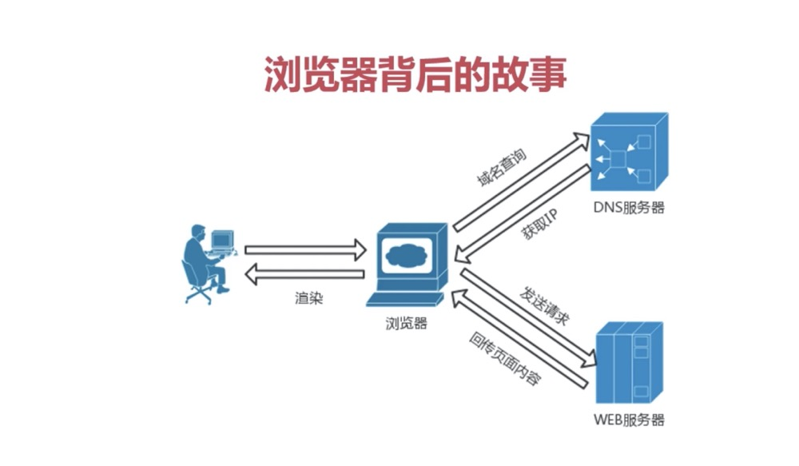
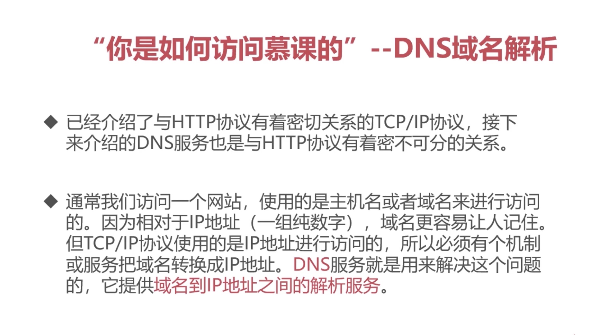

# HTTP初相识--了解HTTP协议
- 相亲对象：HTTP协议（大名：超文本传输协议）
超文本：带有超链接的文本，常见的就是html
- 相亲背景：浏览器背后的故事
- WEB: WEB是一种基于超文本和HTTP的，全球性的，动态交互的，跨平台的分布式 图形信息系统

- HTTP的前世今生：
- 父亲：万维网之父 TimBerners—Lee(蒂姆·贝纳斯·李)
- 家族：TCP/IP 协议族

- 家族规则：
三次握手：根本目的，客户端和服务端要进行连接，要确认双方通讯（接收和发送）正常  
- 一次握手：客户端有发送能力 （SNY=1, seq=x）
- 二次握手：服务端有接收能力和发送能力 （SNY=1, ACK=1, seq=y, ack=x+1）
- 三次握手：客户端有接收能力（ACK=1, seq=x+1, ack=y+1）
>族规的缺陷：需要每次都验证

- HTTP的朋友：DNS

HTTP和DNS的合作过程：
1、客户端浏览器输入域名访问web服务器，
2、通过DNS查询到域名ip地址，
3、在TCP协议的帮助下，与ip对应的web服务器建立TCP连接，三次握手判断双方通讯正常，正常则客户端发送http请求，
4、web服务器在接收到请求后，会根据请求生成响应的内容，也在TCP协议的帮助下，返回给客户端。
5、通讯完成，TCP连接释放